# 《软件开发综合实践》课程设计报告

题目：基于Next.js的校园在线选课系统

主要内容：设计并实现一个面向校园选课场景的在线选课系统。系统采用Next.js、React、PostgreSQL、Redis、Prisma、Better Auth、Docker、Nginx、Vitest、k6等技术，完成学生选课、候补、退课、课表查看、规则诊断、管理员开放期管理、课程统计、名单追踪、操作日志、结果导出、外部接口、异步写回、一致性运维、自动化测试、压力测试和水平扩展部署。报告以ICONIX方法为主线，将用例文本、领域模型、鲁棒分析、时序交互、结构设计、实现代码和测试证据贯通起来，说明系统如何从业务问题逐步落到可运行软件。

## 1 项目背景与需求分析

### 1.1 项目背景

传统教务选课系统在选课时间到达后经常出现页面打不开、登录后无响应、提交按钮长时间转圈、刷新后会话失效等现象。学生在同一时刻集中访问系统，热门课程名额有限，浏览器刷新、重复提交和多设备登录进一步放大请求峰值。对学生而言，系统拥堵带来的问题远超等待几分钟。它会改变选课行为：学生担心错过名额，于是不断刷新页面；刷新又增加后端压力；压力继续升高，页面更难打开。这个循环把本来可以排队处理的业务请求变成了持续冲击系统入口的流量洪峰。

选课拥堵的根源来自业务时间的高度同步。平时教务系统访问量并不高，真正的压力集中在选课开放后的前几十秒到几分钟。所有学生都知道开放时间，所有热门课程都在同一时间释放名额，所有请求都指向少数课程的容量记录。普通信息系统面对的是相对均匀的查询和提交，选课系统面对的是稀缺资源瞬间分配。若系统把每次点击都直接交给数据库事务处理，热门开课班的容量行和登记唯一约束会成为热点。数据库可以保证一致性，却难以在入口高峰中给每个学生快速反馈。

页面打不开还会破坏学生对系统公平性的感受。学生无法区分课程已经满员、自己网络较慢、服务器繁忙、会话失效、提交成功后页面未刷新等情况。系统缺少明确反馈时，学生只能靠刷新和重复点击确认结果。若最终没有选上课，学生会把失败归因于系统不可用，难以判断课程名额是否确实不足。一个好的选课系统应在资源不足时给出稳定的业务结果，例如容量满、已入课表、候补中、时间冲突，而不应让学生面对浏览器空白页和未知状态。

现有选课系统缺少候补功能，进一步放大了热门课程竞争。没有候补队列时，满员课程只剩两种状态：抢到或没抢到。学生如果想等退课名额，只能反复进入系统查看是否有人退课。这种行为会在选课开放后持续制造额外访问压力，也会让退课释放出来的名额被随机刷新到页面的学生抢走。候补机制可以把这种无序刷新转化为明确队列：课程满员后，学生表达候补意愿；有人退课后，系统按顺位递补；管理员能看到候补名单和递补日志。候补减少重复刷新，也提升名额释放后的可解释性。

表1.1 现实痛点与设计回应

| 现实痛点 | 直接影响 | 设计回应 |
| --- | --- | --- |
| 开选瞬间页面打不开 | 学生反复刷新，入口压力继续升高 | Redis预占座位，快速返回业务结果 |
| 热门课名额稀缺 | 数据库容量记录成为竞争热点 | 原子容量闸门，最终写回数据库 |
| 缺少候补队列 | 退课名额被随机刷新抢走 | 显式候补，退课后按顺位递补 |
| 结果反馈不透明 | 学生无法判断失败原因 | 选课检查拆分容量、冲突、状态等原因 |

如表1.1所示，系统设计回应现实痛点时放弃额外装饰功能，把入口削峰、候补递补和规则解释作为主线。

本项目正是从这两个真实痛点出发：开选瞬间系统堵塞，满员课程没有候补。课程设计不复刻完整教务系统，重点抽取选课子域中最关键的问题，构建一个能解释规则、承受并发、追踪名单、支持候补、生成测试证据的在线选课系统。学生端要让学生知道课程能不能选和为什么不能选；管理员端要让教务人员看到名单变化和操作记录；系统内部要保证容量不超卖、候补能递补、异步状态可恢复。

为了解决开选入口拥堵，项目引入Redis预占座位。学生点击选课后，系统先完成规则检查，再由Redis Lua脚本原子判断课程名额并写入临时预占。这个阶段只做入口快速决策，目标是让学生尽快得到已入课表或容量满的明确反馈。随后独立Worker将预占结果异步写回PostgreSQL，形成最终选课登记和操作日志。PostgreSQL继续作为最终权威数据源，Redis承担高峰期的容量闸门。这个设计把开选瞬间的入口压力和最终名单写入拆开，降低学生请求线程的等待时间。

为了解决没有候补的问题，项目把候补纳入选课登记生命周期。正式选课、候补、退课和停开移除都属于CourseRegistration这一领域对象的不同状态。满员后学生可以显式加入候补，系统记录候补时间和候补顺位。正式学生退课后，系统查找同一开课班的候补队首，将其转为有效选课，并写入递补日志。候补课程也会显示在学生课表矩阵中，因为它已经占用了学生的选课意向时间。这样，候补成为选课领域模型中的状态迁移，不停留在页面附加按钮层面。

本项目的背景还包含课程设计评价要求。老师强调领域模型、用例建模、鲁棒分析、动态行为建模和结构设计。若系统只做课程列表、选课按钮和管理员表格，很难体现这些知识点。本项目围绕真实痛点建立分析链路：从学生抢课和候补需求出发，识别学生档案、开课班、资格规则、上课时间、选课登记、操作日志和Redis预占等领域对象；再把学生页面、管理员页面、规则诊断、Redis容量闸门、写回Worker和一致性运维划分为边界对象、控制对象和实体对象；最后用时序图和测试证据证明结构设计能支撑高并发选课和候补递补。

### 1.2 涉众分析

选课系统的涉众关系比普通课程管理页面更复杂，因为不同角色对同一件事有不同理解。学生看到的是能不能选上课，管理员看到的是名单是否准确，运维人员看到的是入口是否被冲垮，外部教务系统关注的是最终结果能否回收。若只从某一个角色出发设计系统，很容易出现局部合理、整体失衡的结果。例如只关注学生快速点击，可能导致容量计数错误；只关注数据库最终一致，可能让页面在高峰期长时间无反馈；只关注管理员统计，可能忽略学生为何不断刷新系统。

学生是最敏感的涉众。选课直接影响学生本学期课表、学分安排和学习计划。学生需要在有限时间内判断课程是否适合自己，避开时间冲突，抢到热门课程，必要时进入候补队列。现有系统堵塞时，学生无法获得可靠反馈，只能用刷新和重复提交对抗不确定性。本系统对学生的回应是把不确定状态拆成明确状态：已入课表、候补中、容量满、时间冲突、名单冻结、课程停开、选课时间未开放。页面不依赖长说明文字，而用选课检查、短标签和课表矩阵呈现这些状态。

管理员是选课秩序的维护者。管理员关注课程名单是否可信，课程停开后学生名单是否统一处理，选课窗口是否按规定开放，导出的结果是否能交给外部教务系统。现有系统在拥堵时，管理员很难判断学生到底没有提交、提交失败、提交成功但页面无响应，还是系统内部积压。本系统为管理员提供课程统计、名单详情、操作日志和一致性运维。管理员能看到已选、候补、退课和停开移除记录，也能看到Redis预占与PostgreSQL最终登记之间是否还有待写回状态。

外部教务主系统是基础数据和最终结果的边界。学生档案、学院、专业、课程、开课班、必修课和学期通常来自学校已有教务体系。本项目不重新实现这些基础资料维护，只通过Seed脚本模拟外部系统输入。选课结束后，本系统通过CSV导出和结果API交还最终登记。这个边界很重要：系统把精力集中在选课期间的动态业务，包括规则判断、名额竞争、候补递补和名单追踪。

运维人员关注的是选课时间一到系统能否保持可服务状态。平时访问量正常不能证明选课系统可靠，真正的考验在开选高峰。运维人员需要健康检查、多实例部署、Redis状态和Worker积压信息。项目提供Nginx多实例入口、/api/health健康接口和一致性运维页面，用来说明系统如何在多应用实例共享Redis和PostgreSQL的条件下保持一致。

测试人员和答辩评审教师也是重要涉众。测试人员需要把业务规则转化为可执行用例，证明系统在正常、异常和边界条件下表现稳定。评审教师关注软件工程方法，尤其关注领域模型是否准确、用例是否完整、鲁棒分析是否把行为过渡到结构、时序图是否说明对象协作。项目因此把测试证据和ICONIX材料纳入交付范围，使课程设计不只停留在页面演示。

这些涉众之间存在天然张力。学生希望点击后立即知道结果，管理员希望最终名单准确，运维人员希望高峰期系统不要崩溃，外部系统希望结果格式稳定。Redis预占加异步写回正是对这种张力的折中：入口快速反馈服务学生，PostgreSQL最终登记服务管理员和外部系统，一致性运维服务运维人员，自动化测试服务质量验证。

表1.2 涉众关注摘要

| 涉众 | 核心关注 | 系统回应 |
| --- | --- | --- |
| 学生 | 能否选上，失败原因是否明确 | 选课检查、候补、课表矩阵 |
| 管理员 | 名单是否准确，操作是否可追踪 | 课程统计、名单详情、操作日志 |
| 外部教务系统 | 基础数据输入，结果回收 | Seed模拟输入，CSV和API输出 |
| 运维和测试人员 | 高峰可用，规则可验证 | 健康检查、运维页、自动化测试和压测 |

如表1.2所示，不同涉众的关注点并不相同，系统需要同时回应学生即时反馈、管理员名单追踪、外部系统结果回收和运维测试证据。

### 1.3 功能需求分析

功能需求来自现实痛点。页面打不开要求系统提供高峰入口能力，缺少候补要求系统提供排队和递补能力，学生反复刷新要求系统提供明确反馈，管理员难以追踪要求系统提供名单和日志，异步架构要求系统提供运维观察。需求分析不能只列按钮，而要说明每个按钮背后的业务问题。

学生端的第一组需求是选课前判断。学生进入选课页后，系统应根据当前学期和学生档案展示课程列表。课程列表不能只显示课程名和选课按钮，还要体现课程类别、学分、名额、状态和本人是否已登记。课程详情需要展示六类选课检查：选课时间、开课状态、课程类型、适合对象、名额、上课时间。这样学生在点击前就能知道问题来自容量、规则、时间还是课程状态。

学生端的第二组需求是高峰提交。学生点击选课后，系统应尽快返回明确结果。若名额可用，页面显示已入课表；若名额已满，页面显示候补入口；若时间冲突，页面指出冲突课程；若重复提交，系统不重复占位；若课程冻结或停开，系统拒绝提交。这里的重点是可处理结果。学生可以接受容量满，但很难接受页面打不开和结果未知。系统需要把技术拥堵转化为业务反馈。

学生端的第三组需求是候补和课表。满员后，学生可以显式加入候补。候补成功后，系统显示候补中，并把候补课程放入课表矩阵。候补课程不计入已选学分，也不增加课程已选人数，但参与时间冲突判断，因为学生已经表达了该时间段的选课意向。学生可以退出候补。若正式学生退课，系统按候补顺位自动递补，递补成功后候补登记转为有效登记。

管理员端的第一组需求是控制选课窗口。管理员需要设置当前学期选课开始和结束时间，系统校验时间范围，保存后影响学生端规则检查。这个功能直接服务教务安排，也能在报告中说明开放期规则如何进入领域模型和服务层。

管理员端的第二组需求是名单追踪。管理员需要按开课班查看名额、已选人数、候补人数、退课记录和停开移除记录。课程详情应展示学生学号、姓名、专业、年级、登记状态和登记时间，还要展示相关操作日志。没有这些信息，管理员无法解释课程为何满员、谁在候补、谁退过课、停开影响了哪些学生。

管理员端的第三组需求是名单控制。冻结名单用于确认课程名单，冻结后学生不能继续选课或退课。停开课程用于取消某个开课班，系统需要把有效登记和候补登记统一转为停开移除，并记录停开原因。冻结和停开看似都是管理员按钮，业务含义完全不同：冻结保留课程和名单，停开结束该开课班的选课资格。

系统后台还需要支持异步写回和结果集成。Redis预占成功后，Worker要把预占写回PostgreSQL；若Worker积压，管理员运维页要显示待入库状态并允许处理写回。选课结束后，管理员可以导出CSV，外部教务系统可以通过API Key读取结果。这样，本系统既能处理高峰选课，也能把最终名单交还给外部教务体系。

图1.1展示系统核心用例。图中没有把Redis、PostgreSQL和Worker画成外部参与者，因为它们属于系统内部结构；外部教务主系统只通过基础数据预置和结果回收与系统发生关系。

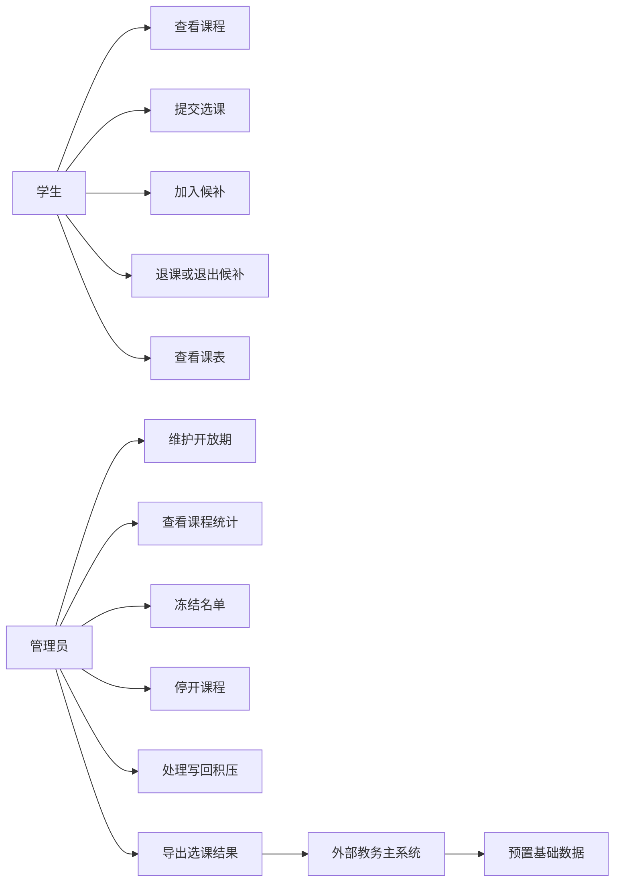

图1.1 系统核心用例概览

功能需求中最容易出错的是规则表达。若系统把所有失败都显示为不可选，学生仍然不知道下一步该做什么。容量满意味着可以候补，时间冲突意味着需要调整课程组合，选课时间未开放意味着需要等待，名单冻结意味着管理员已经锁定课程，停开意味着课程不再提供。本项目把这些规则拆成结构化检查项，服务层返回机器可读结果，前端只负责展示。这个设计让页面表达、服务逻辑和自动化测试使用同一套规则语言。

表1.3 功能需求分组

| 分组 | 主要目标 | 关键功能 |
| --- | --- | --- |
| 学生选课 | 快速得到明确选课结果 | 课程列表、选课检查、正式选课 |
| 候补与课表 | 处理满员后的排队和时间占用 | 加入候补、退出候补、课表矩阵 |
| 管理员工作区 | 维护名单秩序和结果输出 | 开放期、统计详情、冻结、停开、导出 |
| 运维与集成 | 解释异步状态并衔接外部系统 | 写回处理、健康检查、结果API |

如表1.3所示，功能需求围绕学生、管理员、运维和外部集成展开，每组功能都能追溯到前文提出的现实痛点。

### 1.4 非功能需求分析

非功能需求首先来自开选高峰的可用性。现有系统的问题是选课时间一到打不开，因此本项目不能只要求平均响应快。系统需要在瞬时高峰下仍能返回可处理结果。课程设计主压测设定为1000名学生抢100个名额，通过Nginx入口分发到多个Next.js实例。理想结果是100名学生获得正式预占，900名学生收到容量满，服务错误为0，数据库最终登记不超过容量。这个指标关注高峰行为，平时浏览页面的速度只能作为辅助参考。

性能需求还包括削峰和降级。系统无法保证每个学生都选上热门课程，但应避免所有学生一起卡在数据库事务上。Redis预占的目标是把正式名额判断放在入口完成，容量外请求快速返回容量满。对于同一账号重复点击，限流和重复预占检查应拦截异常高频请求。对于Worker尚未写回的情况，页面可以先显示预占状态，管理员运维页显示待写回。这样系统在高峰中保持可解释状态。

一致性需求是选课系统的底线。课程容量为100，最终有效登记不能超过100；enrolledCount必须与有效登记数量一致；候补顺位必须按提交顺序生成；退课后只能递补队首候补；停开课程时有效登记和候补登记都应转为停开移除。Redis预占提高入口性能，但不能削弱PostgreSQL最终一致。Worker写回阶段必须幂等，重复消费任务不能重复增加人数。运维页必须能发现待写回和失败预占。

公平性需求来自学生对名额分配的感受。完全公平的选课还会涉及抽签、优先级和培养方案，本项目不扩展到这些规则，但至少保证同一入口下容量判断原子、重复提交不重复占位、候补按顺位递补、退课释放名额可追踪。候补机制本身也提升公平性，因为退课名额不再依赖学生碰巧刷新到页面，而由系统按队列处理。

安全需求主要体现在身份、权限和结果接口。学生账号只能访问学生工作区和学生接口，管理员账号才能访问后台页面、导出结果和运维动作。外部结果API使用API Key保护，避免未授权读取选课结果。密码存储使用scrypt派生密钥和随机盐，测试覆盖正确密码、错误密码、坏格式哈希和密钥长度异常。开发环境使用明确的Better Auth密钥，正式部署时必须替换为强密钥。

可维护性需求来自业务规则的持续变化。选课系统后续可能增加通知、学分上限、先修课、抽签或分批开放。若规则散落在页面按钮里，后续修改会非常困难。项目把业务规则集中在服务层，把领域对象集中在Prisma模型中，把页面组件限制在展示职责。CourseRegistration统一表达正式、候补、退课和停开移除，减少状态分裂。Redis预占、Worker写回、管理员查询和一致性运维各自独立，便于后续替换或扩展。

可扩展性需求体现在水平部署。Next.js实例不保存本地选课状态，多个实例共享PostgreSQL和Redis。Nginx作为统一入口，把请求分发给多个应用实例。Redis承担选课入口削峰、限流、缓存和Stream任务，PostgreSQL保存最终名单，Worker独立消费写回任务。若Web请求增多，可以增加应用实例；若写回积压，可以增加Worker处理能力；若数据库成为瓶颈，可以继续优化索引和批处理策略。

可测试性需求要求核心规则能脱离浏览器验证。项目使用Vitest覆盖时间冲突算法、密码哈希、缓存失效、选课规则、候补顺位、退课递补、管理员统计、异步写回和一致性运维。Allure报告展示核心用例通过情况，覆盖率报告展示服务层测试结果，k6脚本模拟多学生抢课、显式候补和单账号限流，GitHub Actions执行Prisma校验、测试、静态检查、构建和Docker镜像构建。这些证据用来证明系统具有可验证的工程质量。

表1.4 非功能需求摘要

| 质量目标 | 要求 | 设计抓手 |
| --- | --- | --- |
| 高峰可用 | 开选时返回可处理结果 | Nginx多实例、Redis预占 |
| 数据一致 | 最终登记不超过容量 | Worker幂等写回、数据库锁 |
| 名额公平 | 重复提交不重复占位 | 原子脚本、候补顺位 |
| 可验证 | 规则和性能可复现 | Vitest、Allure、k6、CI |

如表1.4所示，非功能需求没有停留在抽象质量词，已经落实到Nginx、Redis、Worker、数据库锁和自动化测试等具体设计抓手。

## 2 系统分析

### 2.1 用例模型

用例模型首先要划清系统边界。校园选课涉及课程库、培养方案、成绩、教师授课、学生档案、选课登记等多个子域，本系统只处理选课开放期内的动态登记。基础数据由外部教务主系统预置，学生和管理员通过本系统完成选课、候补、退课、名单控制和结果导出。这个边界决定了报告后续的分析重点：系统不展开完整课程库维护，也不设计教师端审批流程，重点放在学生抢课、候补递补、容量一致和管理追踪上。

从参与者看，学生是主要业务触发者，管理员是选课秩序维护者，外部教务主系统是基础数据和最终结果的交换方，后台Worker是系统内部执行者。学生用例强调即时反馈和规则透明，管理员用例强调名单准确和可追踪，外部系统用例强调输入输出边界，Worker用例强调异步状态最终确认。把Worker写进用例模型，目的在于说明Redis预占后还存在一个系统内部用例：异步确认登记。没有这个用例，Redis入口成功与PostgreSQL最终名单之间就缺少分析上的桥梁。

表2.1 核心用例摘要

| 用例 | 参与者 | 目标 |
| --- | --- | --- |
| 学生选课 | 学生 | 在规则通过且容量可用时进入正式名单 |
| 学生加入候补 | 学生 | 满员后进入候补队列，等待递补 |
| 学生退课或退出候补 | 学生 | 释放正式名额或取消候补意向 |
| 管理员控制名单 | 管理员 | 冻结名单、停开课程、查看结果 |
| 异步确认登记 | Worker | 将Redis预占写回PostgreSQL |
| 处理写回积压 | 管理员 | 观察并恢复异步中间状态 |

如表2.1所示，核心用例既包括学生和管理员直接触发的业务，也包括Worker异步确认登记这一系统内部用例。

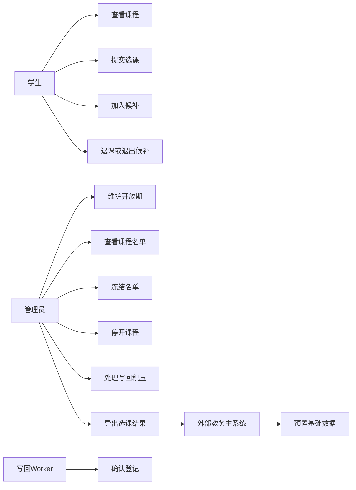

图2.1 用例模型图

如图2.1所示，系统边界内的学生、管理员、Worker和外部教务主系统各自承担不同交互职责，后续领域模型和时序图都围绕这些用例展开。

学生选课用例的前置条件是学生已经登录，学生档案存在，系统能够识别当前学期，开课班处于开放状态。基本事件流从学生打开选课页开始。系统读取学生档案、当前学期、课程、开课班、已有登记和Redis预占状态，生成课程列表和选课检查。学生点击选课后，系统校验开放期、课程状态、课程类别、专业年级、容量和上课时间。非容量规则通过后，系统进入Redis容量闸门。若正式名额可用，Redis生成正式预占并追加写回任务，页面立即显示已入课表。随后Worker消费任务，把预占写回PostgreSQL，形成最终登记和操作日志。

学生选课用例的扩展事件流更能体现真实业务。若课程已经满员，系统返回容量满，页面显示候补入口。若上课时间与已选课或候补课冲突，系统拒绝提交，并在课程详情中指出冲突课程。若课程名单已经冻结，学生不能继续改变名单。若课程已经停开，系统不允许选课。若学生重复点击，Redis预占和数据库唯一约束共同阻止重复占位。后置条件也要分情况描述：成功时先产生短期预占，再由Worker确认最终登记；失败时容量和登记不变化；容量满时学生可以转入候补用例。

学生加入候补用例的前置条件是课程除容量外的规则通过，正式名额已满，学生尚未处于该开课班的有效或候补状态。基本事件流是学生点击候补，系统重新校验开放期、课程状态、专业年级和时间冲突，然后在Redis中生成候补预占和候补序号。Worker写回后，PostgreSQL中出现候补登记。扩展流程包括正式名额临时释放、重复候补、课程停开和写回失败。该用例与学生选课用例分开，是为了避免系统在学生只想抢正式名额时自动加入候补队列。

学生退课或退出候补用例承担状态回收。正式登记退课时，系统要校验课程类别和名单状态。必修课不能退，冻结名单不能退。退课通过后，系统将本人登记改为已退课，减少已选人数，查询候补队首，并把队首候补转为有效登记。候补登记退出时，系统只把候补状态改为已退课，不改变容量，不触发递补。这个用例说明候补不能被看成简单列表，它和正式名单共享同一个登记生命周期。

管理员控制名单用例包含开放期维护、课程详情查看、冻结名单和停开课程。开放期维护改变学生端规则判断；课程详情查看帮助管理员追踪已选、候补、退课和停开移除记录；冻结名单锁定当前名单，保留课程但阻止学生继续改动；停开课程结束该开课班的选课资格，并将有效登记和候补登记统一转为停开移除。处理写回积压用例服务异步架构，管理员可以查看Redis预占和数据库最终名单之间的差异，并触发一批写回处理。

### 2.2 领域模型

领域模型要回答系统中有哪些稳定业务概念，以及它们之间怎样关联。选课系统的核心是学生对某个开课班产生的登记关系，页面按钮只是触发登记变化的入口。课程、学期、学生和专业提供上下文，开课班提供容量和状态，上课时间提供冲突判断，资格规则提供专业年级限制，选课登记记录学生意图和最终结果，操作日志记录状态变化的原因。Redis预占虽然不进入PostgreSQL表，但它表达了一个短生命周期业务事实：学生已经在入口抢到名额或候补顺位，等待最终写回。

表2.2 领域对象职责摘要

| 领域对象 | 业务含义 | 关键职责 |
| --- | --- | --- |
| 学生档案 | 学生的教务身份 | 提供学号、专业、年级 |
| 开课班 | 某学期的一次课程供给 | 保存容量、状态、教师、时间 |
| 资格规则 | 专业选修的可选范围 | 判断专业和年级是否匹配 |
| 选课登记 | 学生对开课班的状态 | 表达已选、候补、退课、移除 |
| 操作日志 | 状态变化的审计记录 | 追踪学生和管理员动作 |
| Redis预占 | 高峰入口的临时状态 | 快速确认名额或候补意向 |

如表2.2所示，领域对象既包含PostgreSQL中的长期业务对象，也包含Redis预占这种短生命周期状态。

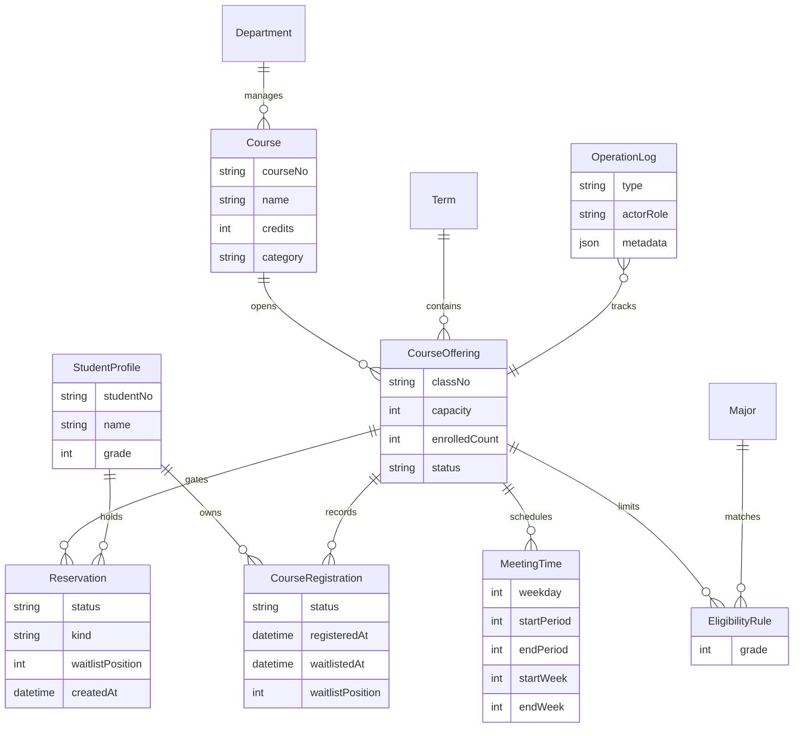

图2.2 领域模型图

如图2.2所示，开课班处在课程、学期、上课时间、资格规则和选课登记之间，是选课子域的核心连接点。

学生档案和课程供给之间不能直接相连，因为学生选择的是某个学期、某个班号、某个教师和某段上课时间组成的开课班，抽象课程本身不足以承载选课结果。课程只说明课程号、名称、学分和类别，开课班才说明容量、已选人数、状态和时间。这个区别很重要。如果只把学生和课程关联起来，系统无法判断同一课程的不同班级、不同时间和不同容量，也无法解释管理员为什么按开课班冻结或停开。

资格规则单独建模，是为了表达专业选修课的可选范围。必修课由外部教务系统预置，学生不能主动退选；公选课默认全校可选；专业选修课需要按学院、专业和年级判断。EligibilityRule把开课班、学院、专业和年级放在同一条规则中，使规则诊断可以明确告诉学生是否适合该课程。该模型不引入完整培养方案，保持了课程设计的边界，同时又能表达关键限制。

选课登记是领域模型的核心。它表达学生选课意图和结果的生命周期，不能按普通关联表理解。有效选课、候补、退课和停开移除都属于同一登记对象的不同时刻。采用这种模型后，退课递补不需要在正式表和候补表之间搬迁数据，只需要把队首候补登记的状态改为有效。停开课程也能统一处理有效和候补登记。管理员查看名单时，可以在同一开课班下看到完整状态历史。

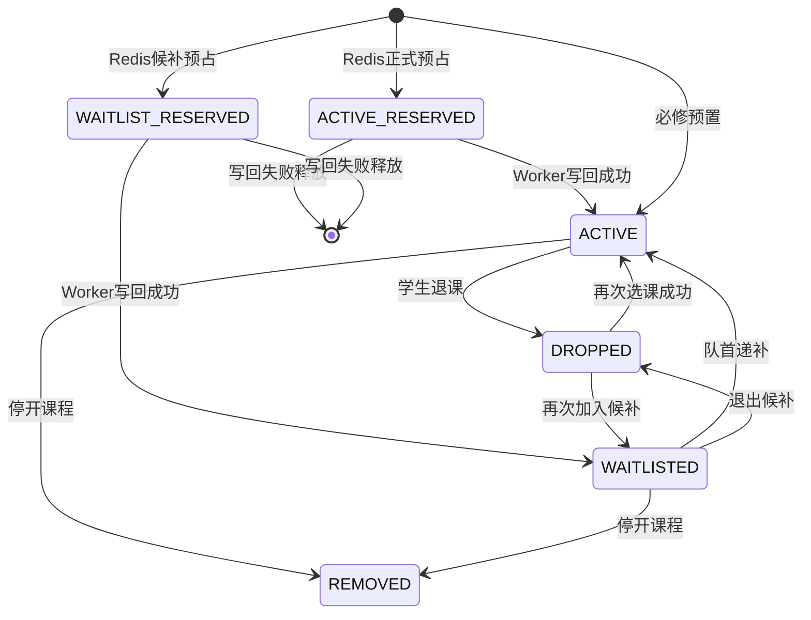

图2.3 选课登记状态机

如图2.3所示，正式选课、候补、退课、停开移除和Redis预占都可以纳入同一条登记生命周期分析。

Redis预占是领域模型中的临时状态。它不进入PostgreSQL最终表，但在分析阶段必须被看见。学生点击选课后，系统可能已经在Redis中确认正式名额，页面也显示已入课表，可数据库尚未产生最终登记。若忽略Reservation，就无法解释这个中间阶段，也无法解释一致性运维页面为什么存在。分析中把Reservation作为临时领域状态，可以把高并发入口、Worker写回和最终登记连接起来。

### 2.3 关键业务流程分析

关键业务流程分析要说明系统怎样一步步完成核心业务。这里选取四条主线：正式选课、满员候补、退课递补、管理员处理写回积压。它们覆盖学生入口、候补状态机、数据库事务和异步运维。分析时采用鲁棒分析思想，把对象分为边界对象、控制对象和实体对象。边界对象接收操作并展示结果，控制对象协调规则和状态变化，实体对象保存业务事实。

表2.3 鲁棒对象分类

| 类型 | 典型对象 | 职责 |
| --- | --- | --- |
| 边界对象 | 学生选课页、课程详情、管理员运维页 | 接收操作，展示状态 |
| 控制对象 | 规则诊断、容量闸门、写回Worker、退课递补服务 | 编排规则和状态迁移 |
| 实体对象 | 学生档案、开课班、选课登记、操作日志、预占状态 | 保存业务事实 |

如表2.3所示，鲁棒分析把页面、控制逻辑和业务事实分开，避免学生页面直接承担事务和规则判断。

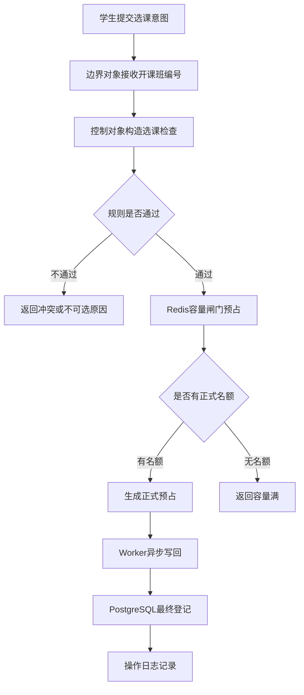

图2.4 学生选课鲁棒流程图

如图2.4所示，学生选课流程先经过规则诊断，再进入Redis容量闸门，最后由Worker写回PostgreSQL。

正式选课流程从边界对象开始。学生选课页只收集学生意图，不直接判断复杂规则。控制对象先构造选课检查，检查开放期、课程状态、课程类别、专业年级、容量和时间冲突。实体对象在这里提供事实：学生档案提供专业和年级，开课班提供容量和状态，资格规则提供可选范围，上课时间和已有登记提供冲突依据。规则通过后，容量闸门在Redis中完成原子预占。这个设计把页面展示、规则判断和数据事实分开，降低了页面层的复杂度。

满员候补流程体现业务分叉。正式选课返回容量满时，系统不替学生自动候补，而让边界对象显示候补入口。学生再次点击候补后，控制对象重新校验非容量规则。这样设计是因为候补属于新的业务意图，不能当作失败状态处理。候补成功后，Redis保存候补预占和顺位，Worker写回候补登记。候补课程进入课表矩阵，但不增加已选人数。该流程把满员后的无序刷新变成了有序排队。

退课递补流程体现事务边界。学生退正式课时，控制对象必须在一个数据库事务中完成多个动作：校验是否可退，更新本人登记，减少已选人数，查找候补队首，将队首候补转为有效登记，恢复已选人数，写入退课和递补日志。若这些动作分散执行，中途失败会造成容量和名单不一致。开课班锁保证同一门课的递补顺序稳定，学生锁避免同一学生重复提交。

管理员处理写回积压流程体现异步系统的运维闭环。Redis预占成功后，Worker可能尚未写回数据库。管理员打开一致性运维页时，系统扫描Redis容量闸门、学生预占状态和PostgreSQL登记数量，给出正常、待写回、需处理或异常的判断。管理员点击处理写回后，控制对象重投待写回任务，并调用Worker处理一批消息。这个流程让异步系统的中间状态可见，也让课程设计能够解释高并发优化带来的工程代价。

### 2.4 分析结论

系统分析阶段形成了后续设计的输入。第一，系统边界应聚焦选课子域。学生档案、课程库和必修课来自外部教务体系，本系统处理开放期内的动态登记。这个边界使后续架构不需要设计完整课程库和教师端，却必须重点设计学生选课、候补递补、管理员名单和结果导出。

第二，核心领域对象是选课登记。开课班提供可竞争资源，学生档案提供选择主体，资格规则和上课时间提供限制条件，操作日志提供追踪依据，但真正发生生命周期变化的是选课登记。正式、候补、退课和停开移除统一建模，使业务语言、数据库结构和服务层事务保持一致。

第三，规则必须结构化。选课失败不能只返回一句不可选。开放期、课程状态、课程类别、专业年级、容量和时间冲突需要分别形成检查项。这个结论直接影响学生课程详情、按钮禁用、服务返回值和测试断言。规则结构化后，前端展示更清楚，测试也能验证具体失败原因。

第四，高并发入口需要区分临时状态和最终状态。Redis预占解决选课时间一到系统堵塞的问题，PostgreSQL保存最终名单。二者之间必然出现待写回状态，因此Worker、一致性运维和操作日志都属于架构完整性的一部分。缺少这些控制对象时，系统只能做到入口快速，难以解释和恢复中间状态。

表2.4 分析成果与设计输入

| 分析成果 | 对设计的影响 |
| --- | --- |
| 选课子域边界 | 架构只围绕学生、管理员、外部结果接口展开 |
| 选课登记状态机 | 数据库用统一登记表表达正式、候补、退课、移除 |
| 结构化选课规则 | 服务层返回检查项，页面用标签和详情展示 |
| Redis临时预占 | 架构加入Worker和一致性运维工作区 |
| 候补顺位和递补 | 退课服务必须在事务内处理队首转正 |

如表2.4所示，分析阶段产出的结论直接进入数据库设计、服务层划分、Redis预占和退课递补事务。
## 3 系统设计

### 3.1 总体架构设计

总体架构设计首先要回答系统承压位置在哪里。选课系统平时流量不高，开选瞬间却会把大量请求集中到少数热门开课班。若所有请求都直接进入数据库事务，容量行、登记唯一约束和候补顺位都会变成热点。系统需要在入口快速判定名额，同时把最终名单落到可靠存储中。由此形成两层事实：Redis保存短期预占状态，PostgreSQL保存最终登记和审计日志。Redis负责挡住峰值，PostgreSQL负责留下可追溯的业务结果。

系统采用Next.js全栈架构。浏览器访问学生端、管理员端和登录页，页面提交通过Server Actions或API Routes进入同一组业务服务。业务服务不直接散落在页面组件里，而集中在选课服务、管理员服务、运维服务和写回服务中。Prisma统一访问PostgreSQL，Redis承载限流、容量闸门、预占状态和Stream任务。Better Auth负责登录、退出和会话保护。Nginx用于本地水平扩展演示，将同一个入口分发到多个Next.js实例。独立Worker消费Redis Stream，把预占结果写回PostgreSQL。

这种架构仍然保持单体应用的开发便利，但在运行结构上已经具备水平扩展特征。Next.js实例不保存本地名单，也不依赖进程内会话。任意实例收到请求后，都从PostgreSQL和Redis读取状态。学生先后请求落到不同实例，仍能看到一致的课程名额、本人登记和候补状态。Nginx只做入口转发，业务一致性由共享Redis、共享PostgreSQL和服务层锁控制。

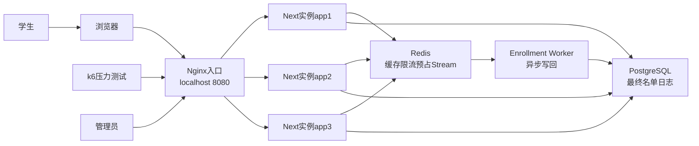

图3.1 系统总体架构图

如图3.1所示，系统入口可以来自浏览器，也可以来自k6压测脚本。Nginx把请求分发给三个应用实例，应用实例共享Redis和PostgreSQL。Redis与Worker之间通过Stream传递写回任务，Worker最终写入PostgreSQL。管理员与学生使用相同入口，只是权限、页面和可访问功能不同。这个结构能在答辩时直观说明水平扩展需要把状态从Web进程中移出去，不能只靠多开几个服务。

表3.1 架构组成与职责

| 组成部分 | 主要职责 | 设计原因 |
| --- | --- | --- |
| Next.js应用 | 页面、动作、接口、服务调用 | 保持前后端协作简单 |
| Redis | 限流、预占、Stream任务 | 承受开选入口高峰 |
| PostgreSQL | 最终名单、规则、日志 | 保存可靠业务事实 |
| Worker | 异步写回、幂等确认 | 削峰后再写数据库 |
| Nginx | 多实例转发 | 演示水平扩展 |

如表3.1所示，架构组成围绕入口、业务处理、最终存储和部署扩展展开。每个组成部分都有明确职责，避免把高并发、名单持久化和页面展示混在同一层处理。

架构分层可以概括为表现层、业务服务层、数据访问层和基础设施层。表现层包括学生页面、管理员页面、登录页面和API入口。业务服务层包括选课服务、管理员服务、课表服务、Redis预占服务、写回Worker和一致性运维服务。数据访问层由Prisma Client统一封装PostgreSQL访问。基础设施层包括PostgreSQL、Redis、Nginx、Docker Compose、GitHub Actions和k6。分层的目的在于控制变化范围：页面可以调整布局，服务层仍保持规则不变；Redis预占脚本可以优化性能，数据库模型仍保存最终事实；管理员页面可以拆分工作区，底层统计服务仍复用同一批查询。

Redis和PostgreSQL的职责边界是本设计的关键。Redis保存短期入口状态，包括课程容量闸门、学生预占记录、限流计数、缓存和Stream任务。PostgreSQL保存最终业务事实，包括学生、课程、开课班、登记、资格规则和操作日志。Redis预占成功后，前端可以立即显示已入课表或候补中，但审计和结果导出仍以PostgreSQL登记为准。管理员一致性运维页展示两者之间的过渡状态，使异步架构不成为隐藏细节。

系统没有把候补设计成单独微服务，也没有把课程管理、账号管理和教师端全部纳入范围。这是系统边界带来的设计选择。课程设计重点是选课子域，真正复杂的部分是名额竞争、规则判断、候补递补、异步写回和名单追踪。若过早拆成多个后端服务，接口治理和部署复杂度会盖过领域分析本身。当前架构用一个Next.js应用组织边界对象和控制对象，用独立Worker承接异步写回，用Nginx演示多实例运行，能在规模和课程设计工作量之间取得平衡。

水平扩展依赖无状态Web实例。应用实例不保存内存会话和本地名单，所有实例通过共享数据库和Redis获得一致视图。Nginx转发时保留Host和X-Forwarded-Host，避免Next.js Server Actions发现Origin与转发主机不一致后拒绝POST请求。健康接口返回实例标识、数据库状态和Redis状态，可用于检查多实例入口是否可用。这个健康检查不涉及复杂业务，却能帮助定位502、连接失败、数据库不可达和Redis不可达等部署问题。

从ICONIX角度看，总体架构是分析模型的落地。学生选课页、管理员统计页和一致性运维页属于边界对象；选课服务、RedisSeatGate、EnrollmentWritebackWorker和EnrollmentOpsService属于控制对象；CourseOffering、CourseRegistration、EligibilityRule、OperationLog和Redis Reservation属于实体对象或临时领域状态。系统设计没有脱离前一章分析结果，它把鲁棒分析中的对象职责转化为运行组件和模块边界。

### 3.2 功能模块设计

功能模块设计遵循两个划分依据。第一，按使用者的工作场景划分边界对象，学生只面对选课和课表，管理员只面对开放期、课程统计、操作日志和一致性运维。第二，按业务规则的变化点划分控制对象，选课规则、容量预占、候补递补、写回确认和运维恢复各自形成服务。这样划分后，页面不会承担复杂事务，服务也不会被具体界面布局牵引。

学生工作区包含两个主要视图。选课视图负责展示当前学期课程、本人登记状态、容量进度、课程详情和规则诊断。课表视图负责展示星期一到星期日的节次占用矩阵和登记明细。正式选课和候补课程都会进入矩阵，正式课程显示已选，候补课程显示候补。这个设计来自业务事实：候补虽不计学分，也不占正式名额，但它占用学生的意向时间，后续冲突判断必须考虑它。

管理员工作区拆分为四个页面。开放期页面只处理选课窗口，课程统计页面只处理课程容量、名单、冻结和停开，日志页面只处理操作追踪，一致性运维页面只处理Redis预占、待写回、失败状态和数据库最终登记。拆分后，每个页面都能对应一个明确边界对象。答辩演示时也更容易说明管理员按工作任务进入不同工作区，避免把所有操作堆在同一张后台页面里。

服务层是模块设计的中心。学生页面和压测接口都进入同一组选课服务，避免页面操作和HTTP接口出现两套规则。正式选课调用selectCourse，显式候补调用joinWaitlist，退课和退出候补调用dropCourse。规则诊断构造器负责把开放期、课程状态、课程类别、适合对象、容量和时间冲突转换为结构化结果。Redis预占服务负责入口原子判断，写回Worker负责把预占落库，管理员服务负责开放期、统计、日志和名单操作，运维服务负责扫描和修复异步状态。

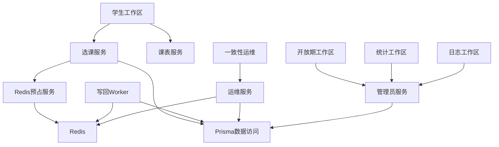

图3.2 功能模块关系图

如图3.2所示，学生工作区不直接访问Redis和PostgreSQL，它只通过选课服务和课表服务拿到结果。管理员统计和日志不直接扫描页面状态，它们通过管理员服务读取数据库。运维工作区同时读取Redis和PostgreSQL，因为它的职责就是比较两边状态。Worker不经过页面触发，它消费Stream任务并调用数据库写入逻辑。模块之间的依赖保持单向，页面依赖服务，服务依赖数据访问和基础设施，基础设施不反向依赖页面。

表3.2 主要模块与接口入口

| 模块 | 入口 | 输出 |
| --- | --- | --- |
| 学生选课 | 选课动作和选课API | 已选、满员、候补、拒绝原因 |
| 学生课表 | 学生页面查询 | 节次矩阵和登记明细 |
| 管理员统计 | 统计页面查询 | 容量、名单、日志摘要 |
| 写回Worker | Redis Stream | 最终登记和操作日志 |
| 一致性运维 | 运维页面动作 | 快照、重投、清理结果 |

如表3.2所示，主要模块的入口和输出都围绕业务意图组织。学生端入口强调即时反馈，管理员端入口强调追踪和处理，Worker和运维模块强调异步状态的确认与恢复。

学生端组件也按职责拆分。CourseStatusBadges只把规则状态转成短标签，不判断业务规则。CourseAction只决定显示选课、候补、退课或禁用按钮，不直接访问数据库。CapacityMeter只展示容量数字和进度条。MeetingTimeList只展示上课时间。ScheduleGrid只把登记记录映射到星期和节次。组件越专注，页面越容易在不改业务规则的情况下调整布局。

管理员端组件围绕工作区组织。管理员共享外壳负责登录身份、退出按钮和导航入口。开放期表单负责读取和保存选课窗口。统计表负责展示开课班行，详情Sheet负责展示名单和日志。日志页只展示OperationLog，减少统计页负担。运维表负责展示课程维度的一致性状态，并提供处理写回和清理失败预占动作。这样的模块拆分能对应模板中要求的功能模块图，也能对应ICONIX的边界对象识别。

模块之间需要明确哪些数据可以同步返回，哪些数据必须异步确认。正式选课和候补点击需要快速返回，因为学生在等待页面反馈；最终登记写入可以异步完成，因为Redis预占已经给出短期状态。退课和候补递补需要同步完成，因为退课会立即释放名额，且递补会改变另一名学生的正式登记。管理员冻结和停开也需要同步落库，因为它们改变课程状态和名单有效性。这个区分决定了哪些模块通过Redis Stream解耦，哪些模块必须使用数据库事务。

测试模块独立于业务页面，但不独立于业务服务。Vitest集成测试直接调用服务层，验证选课、候补、退课递补和运维处理。k6压测调用HTTP接口，验证入口在并发下的表现。Allure和覆盖率报告记录自动化测试结果。脚本模块负责准备压测学生、压测课程和压测摘要。它们属于离线验证能力，也是课程设计证明工作量和质量的重要组成部分。

### 3.3 数据设计

数据设计从领域模型出发，页面字段只作为展示入口。系统要保存三类信息：第一类是基础资料，包括学生、学院、专业、课程、学期和开课班；第二类是选课过程产生的状态，包括有效选课、候补、退课、停开移除和候补顺位；第三类是审计和运维信息，包括操作日志、Redis预占和写回任务。PostgreSQL承载长期事实，Redis承载短期入口状态，两者共同支撑高并发选课。

PostgreSQL采用Prisma schema描述模型、枚举、关系和索引。认证相关模型包括User、Session、Account和Verification。业务模型包括Department、Major、StudentProfile、Term、Course、CourseOffering、MeetingTime、EligibilityRule、CourseRegistration和OperationLog。schema字段旁已加入中文短注释，方便直接从模型文件读出业务含义。报告中的数据设计与schema保持一致，避免文档和代码脱节。

学生资料由Department、Major和StudentProfile组成。学院保存学院代码和学院名称，专业保存专业代码、专业名称和所属学院，学生档案保存学号、姓名、年级、学院和专业。选课规则会按学院、专业和年级判断学生是否适合某门专业选修课，因此StudentProfile需要支持按学院、专业和年级查询。认证模型中的User通过profileId关联学生档案，系统登录后能从账号身份转入业务身份。

课程资料由Term、Course、CourseOffering和MeetingTime组成。Term保存学期代码、学期名称、学期起止时间、选课开始时间、选课结束时间和当前学期标记。Course保存课程号、课程名、学分、课程类别和开课学院。CourseOffering表示具体开课班，保存班号、名额、已选人数、任课教师、开课状态、停开原因、学期和课程。MeetingTime保存星期、起止节次和起止周次，同一开课班可以有多条上课时间记录。课程和开课班分开后，同一门课程可以在不同学期、不同教师和不同容量下开设。

规则和登记数据由EligibilityRule、CourseRegistration和OperationLog组成。EligibilityRule记录某个开课班允许哪个学院、专业和年级选择，主要服务专业选修课。CourseRegistration记录学生对开课班的登记状态，保存加入时间、候补时间、候补顺位、学生ID和开课班ID。OperationLog记录操作类型、操作角色、操作者、目标对象、日志内容和附加JSON，用于审计学生选课、候补、退课、候补转入、冻结、停开、导出和接口访问。

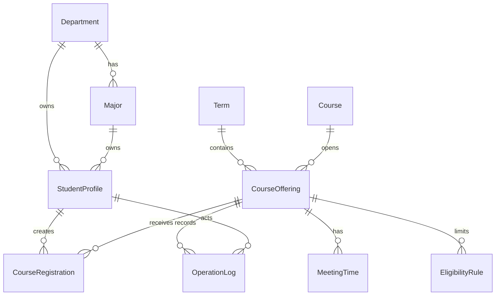

图3.3 数据实体关系图

如图3.3所示，开课班是数据模型的中心。一个学期包含多个开课班，一门课程可以在不同学期开设多个班，一个开课班拥有上课时间、资格规则和选课登记。学生通过CourseRegistration连接到CourseOffering，管理员通过OperationLog追踪开课班和登记变化。这个结构与领域模型保持一致：系统处理学生对具体开课班的登记，不处理抽象课程层面的兴趣。

表3.3 核心数据表设计要点

| 数据表 | 保存内容 | 关键设计 |
| --- | --- | --- |
| CourseOffering | 开课班、容量、状态 | 名额和名单控制中心 |
| CourseRegistration | 已选、候补、退课 | 同一对象承载登记生命周期 |
| EligibilityRule | 适合学院专业年级 | 课程资格规则结构化 |
| MeetingTime | 星期节次周次 | 支撑冲突判断和课表 |
| OperationLog | 操作审计 | 支撑追踪和答辩证据 |

如表3.3所示，数据表设计避开平均展开所有字段，抓住开课班、登记、资格、时间和日志五类核心数据。它们分别回答名额由谁控制、学生处在什么状态、谁适合选课、是否发生冲突以及操作如何追溯。

CourseRegistration是最重要的表。系统没有为候补单独建表，候补作为登记生命周期中的状态存在。ACTIVE表示正式入选，WAITLISTED表示候补，DROPPED表示学生退课或退出候补，REMOVED表示课程停开后统一移除。这样设计有三个好处。第一，学生对某个开课班只有一条登记记录，生命周期清楚。第二，管理员查看名单时可以在同一个表中看到有效、候补、退课和移除。第三，退课递补只需在同一开课班下查找WAITLISTED队首并修改状态，无需跨表搬迁数据。

EligibilityRule解决专业选修课资格问题。课程是否必修可以由CourseCategory判断，公共选修课通常面向所有学生，专业选修课则需要限制学院、专业和年级。若把这类规则写死在代码里，新增专业或调整年级范围就要改服务逻辑。EligibilityRule把规则转成数据，服务层只负责匹配学生档案和规则记录。一个开课班可以有多条资格规则，用来覆盖多个专业或年级。没有资格规则的公共选修课可以按课程类别直接放开。

枚举设计体现领域状态。CourseCategory包含必修、专业选修和公共选修。OfferingStatus包含开放、名单冻结和已停开。RegistrationStatus包含已选、候补中、已退课和停开移除。OperationType包含学生选课、加入候补、学生退课、候补转入、退出候补、冻结名单、停开课程、调整时间、导出结果和接口查询。枚举让代码、数据库和报告中的业务词汇保持一致，也减少前端根据字符串猜测状态的风险。

索引围绕高频查询和一致性维护设计。学生端经常按学生和状态查询登记，因此CourseRegistration设置studentId和status索引。管理员统计经常按开课班和状态聚合，因此设置offeringId和status索引。候补递补需要按开课班、状态和候补顺位查找队首，因此设置offeringId、status和waitlistPosition组合索引。开课班按当前学期和状态展示，因此CourseOffering设置termId和status索引。资格规则按学院、专业和年级匹配，因此设置departmentId、majorId和grade索引。

enrolledCount属于受控冗余字段。理论上，有效选课人数可以每次统计CourseRegistration中ACTIVE记录得到，但学生列表和管理员统计会频繁展示容量，压测场景下大量请求也会读取名额。系统保留enrolledCount提升读取效率，同时用事务、Worker幂等逻辑和运维校验保证它与ACTIVE数量一致。一致性运维页会把enrolledCount、数据库有效登记和Redis正式预占放在同一行展示，帮助发现异常。

Redis预占没有进入PostgreSQL表，但它必须能映射到数据库对象。每条预占记录至少包含学生ID、开课班ID、预占状态和时间信息。正式预占可写回ACTIVE登记，候补预占可写回WAITLISTED登记，失败预占可在运维页清理。Redis Stream中的任务也以学生和开课班作为幂等键。只要这个映射稳定，Worker重复消费或管理员重投任务都不会生成重复登记。

数据设计的最终目标是让每个业务问题有明确的数据落点。课程是否开放落在Term和CourseOffering状态上；学生是否适合落在StudentProfile和EligibilityRule上；是否冲突落在MeetingTime和CourseRegistration上；是否满员落在Redis gate、enrolledCount和ACTIVE登记上；候补顺位落在waitlistedAt和waitlistPosition上；管理员追责落在OperationLog上。这样，报告中的领域分析、数据库设计和测试断言可以互相对应。

### 3.4 关键交互设计

关键交互设计要说明对象如何协作完成一次业务结果。页面点击只是表面动作，真正需要设计的是请求进入系统后经过哪些控制对象、哪些数据在Redis中形成临时状态、哪些数据最终写入PostgreSQL，以及异常或积压时如何恢复。本系统选择四个代表场景展开：正常选课预占与写回、满员后显式候补、退课自动递补、管理员处理写回积压。它们分别覆盖入口高并发、候补队列、最终登记事务和异步运维闭环。

表3.4 关键交互场景

| 场景 | 主要对象 | 设计关注 |
| --- | --- | --- |
| 正常选课 | 选课服务、Redis、Worker | 快速预占和最终落库 |
| 满员候补 | 候补服务、Redis、Worker | 显式加入候补 |
| 退课递补 | 退课服务、数据库 | 容量和队首转入 |
| 处理积压 | 运维服务、Worker | 待写回恢复 |

如表3.4所示，四个交互场景覆盖了选课系统的主要变化点。正常选课关注入口速度，满员候补关注学生意愿，退课递补关注队列公平，处理积压关注异步恢复。

正常选课交互从学生点击选课开始。页面提交开课班编号后，Server Action调用选课服务。选课服务先读取学生档案、当前学期和开课班，再构造规则诊断。规则诊断必须先排除非容量问题，例如未到开放期、课程停开、名单冻结、专业年级不匹配和时间冲突。只有这些规则通过后，系统才进入Redis容量闸门。这样可以避免不符合规则的请求占用名额。

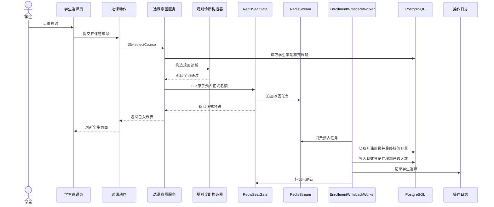

图3.4 正常选课时序图

如图3.4所示，RedisSeatGate通过Lua脚本完成正式名额预占。脚本需要在一个原子动作内完成重复提交判断、容量判断、预占写入和Stream任务追加。若脚本返回正式预占成功，页面立即刷新为已入课表。此时PostgreSQL可能尚未写入登记，但Redis reservation已经表达短期成功状态。Worker随后消费Stream任务，获取开课班锁，复核容量和登记唯一约束，写入ACTIVE登记并增加enrolledCount，最后标记预占已确认。这个过程把学生等待时间控制在入口预占阶段，把数据库写入转移到后台。

满员候补交互体现用例拆分。系统没有在正式选课满员后自动把学生放入候补，因为候补代表另一种明确意愿。学生点击选课时，若Redis容量闸门返回满员，页面显示候补入口。学生再次点击候补，系统重新校验非容量规则，再写入候补预占。候补预占不会增加正式名额，也不会增加已选学分，但会进入课表矩阵和时间冲突判断。

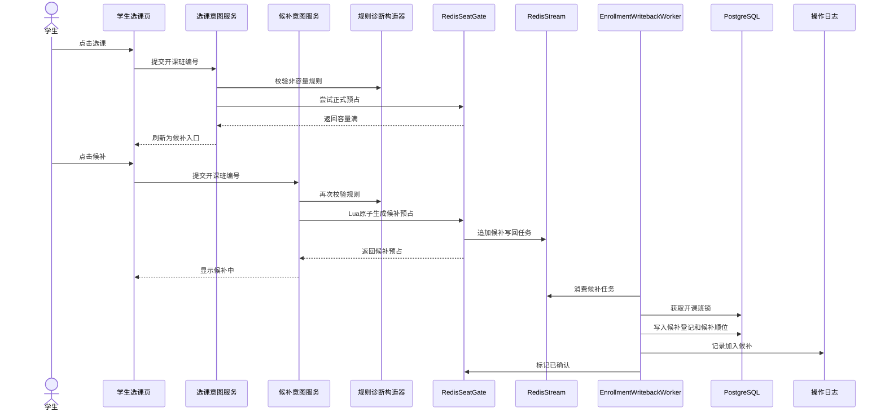

图3.5 满员候补时序图

如图3.5所示，候补与正式选课共用规则诊断，但容量规则含义不同。正式选课要求名额可用，候补要求课程允许排队且本人没有与现有已选或候补课程冲突。Redis为候补生成候补预占和写回任务。Worker写回时计算候补顺位，写入WAITLISTED登记和操作日志。学生端不展示候补第几位，减少界面负担；管理员详情中保留顺位，便于追踪名单。

退课递补交互直接操作PostgreSQL，因为它改变最终名单。正式学生退课后，系统要把原登记改为DROPPED，减少开课班已选人数，然后查找同一开课班的候补队首，将该候补登记改为ACTIVE，再把已选人数加回。这个过程必须在一个事务中完成，否则可能出现名额已释放但队首未转入，或队首已转入但容量计数未恢复的中间错误。

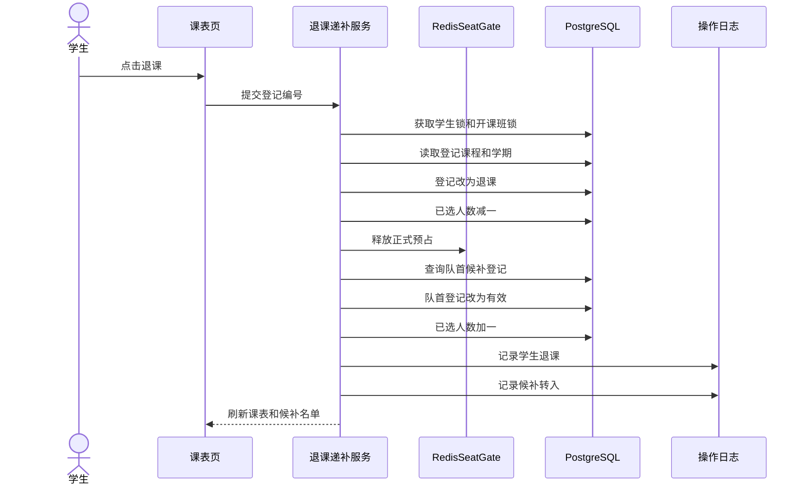

图3.6 退课自动递补时序图

如图3.6所示，退课递补需要同时写两类日志：一条记录退课学生的主动退课，一条记录候补学生转为正式入选。这个设计服务管理员追踪。若只修改状态而不记录日志，管理员在课程详情中只能看到最终名单，无法解释名额何时释放、谁因此转入。退课还要释放Redis中的正式预占，避免运维页继续看到过期入口状态。

管理员处理写回积压交互解决异步架构的可恢复问题。Redis预占和Worker写回之间存在时间差。正常情况下这个时间差很短，学生刷新页面后很快能看到数据库确认结果。但在答辩或压测中，若Worker尚未启动，Redis会积累ACTIVE_RESERVED或WAITLIST_RESERVED状态。系统不能让这些状态藏在后台，管理员需要一个入口查看和处理。

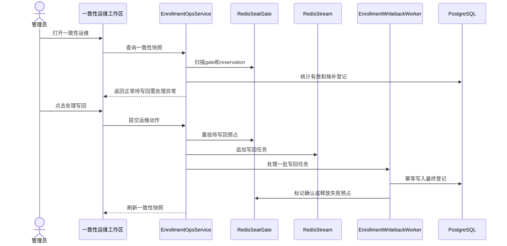

图3.7 管理员处理写回积压时序图

如图3.7所示，一致性运维服务先扫描Redis gate、reservation和PostgreSQL登记，生成课程维度快照。快照会展示容量、数据库有效登记、Redis正式预占、待写回正式预占、待写回候补预占和失败预占。管理员点击处理写回时，服务重投待写回任务并调用Worker批处理逻辑。Worker幂等写入数据库，成功后标记Redis预占已确认，失败后释放或标记失败。这个交互把异步系统中常见的积压、重复投递和部分失败变成可观察、可恢复的操作。

关键交互设计还要处理跨实例问题。学生请求可能落到app1，页面刷新可能落到app2，Worker可能是独立容器。所有对象之间不能依赖进程内变量。正式名额通过Redis gate判断，最终登记通过PostgreSQL保存，写回任务通过Redis Stream传递，日志通过OperationLog追踪。只要这些共享状态设计稳定，多实例运行就不会改变业务语义。

这些时序图也说明了页面与服务之间的边界。页面只提交用户意图并展示结果，不决定规则；规则诊断构造器只生成结构化检查，不修改状态；RedisSeatGate只负责入口预占，不生成最终名单；Worker只消费预占并写入最终登记，不处理页面布局；运维服务只比较和修复状态，不替代正常选课用例。职责边界清楚后，系统既能扩展功能，也能写出清晰测试用例。

### 3.5 质量属性设计

质量属性设计不能停留在响应快、安全、易维护这类泛泛表述。选课系统的质量目标来自业务场景：开选瞬间不能堵死，热门课不能超卖，候补要按顺位递补，异步写回不能丢失，管理员要能解释名单变化，多实例部署后行为仍一致。因此，本项目把质量目标转化为具体机制，并在测试章节用自动化测试、运维快照和压测报告验证。

表3.5 质量属性与设计机制

| 质量目标 | 设计机制 | 验证方式 |
| --- | --- | --- |
| 性能 | Redis预占和异步写回 | k6压测P95和错误率 |
| 一致 | Redis原子闸门和数据库锁 | 超卖测试和运维校验 |
| 可恢复 | 待写回扫描和重投 | 运维页处理积压 |
| 可观测 | 操作日志和健康接口 | 日志页和健康检查 |
| 可测试 | 服务层规则集中 | Vitest和CI |

如表3.5所示，每个质量目标都对应具体机制和验证方式。质量属性因此不再停留在设计口号中，而能落到Redis脚本、数据库事务、运维页面、日志、健康检查和自动化测试上。

性能设计的核心是把高并发入口从同步数据库事务改为Redis预占。Redis Lua脚本在单线程执行上下文中完成容量判断、重复提交判断、预占写入和Stream任务追加。正式名额已满时，服务快速返回容量满，避免所有请求排队进入PostgreSQL。Worker再分批处理写回任务，数据库压力从峰值请求线程转移到可控后台进程。压测报告关注请求数、P95延迟、正式入选、容量满、服务错误和数据库一致性，避免只展示平均响应时间。

性能设计还体现在页面查询上。学生端展示课程列表时，需要同时呈现课程、容量、本人登记、规则诊断和上课时间。服务层批量读取当前学期课程、本人登记和课程时间，减少页面组件各自发起查询。管理员统计页按开课班聚合登记状态，课程详情再按选中的开课班加载名单和日志。这样可以避免在一个页面上一次性展开所有课程的所有登记，减轻数据库和页面渲染压力。

一致性设计采用入口和落库双重保护。入口阶段由Redis原子脚本保证正式预占不超过容量。写回阶段由PostgreSQL开课班锁保证最终登记、已选人数和候补顺位一致。若Worker重复消费同一任务，幂等逻辑会识别已有登记或已确认预占，避免重复增加容量。退课递补仍使用数据库事务，因为它直接修改最终登记和容量计数，需要立即保持一致。这个设计承认Redis和PostgreSQL之间存在短暂时间差，同时用运维快照和幂等写回控制风险。

候补递补的一致性需要单独说明。候补队列按同一开课班内waitlistPosition排序。正式学生退课时，系统在事务中读取队首候补，改为ACTIVE，并同步调整enrolledCount。若候补学生已经退出候补，状态不再是WAITLISTED，递补查询自然跳过。若课程冻结或停开，服务会拒绝新的选课、候补和退课动作，管理员停开会把有效和候补登记统一改为REMOVED。这样，课程状态对登记状态形成约束。

可恢复设计来自一致性运维工作区。异步写回天然存在中间状态，管理员需要看到Redis正式预占、正式待入库、候补待入库、失败预占、数据库有效登记和数据库候补登记。页面用正常、待写回、需处理、异常等短状态表达结论。管理员点击处理写回时，运维服务重投待写回任务并处理一批Worker任务；点击清理失败预占时，只清理FAILED或悬空状态，不触碰正常预占和已确认预占。这个设计让异步架构有人工恢复入口，也便于答辩时解释系统内部状态。

可观测设计依赖操作日志、健康接口和可视化测试报告。学生选课、加入候补、退课、候补转入、冻结名单、停开课程、开放期调整、结果导出和接口查询都会写入OperationLog。管理员日志页把操作类型、角色、时间和消息集中展示。健康接口返回应用实例、数据库和Redis状态，可用于Nginx多实例演示和故障定位。Allure报告、覆盖率报告和k6 HTML报告则把自动化测试和压力测试结果转化为可展示材料。

安全设计围绕身份认证、权限隔离和接口保护展开。Better Auth负责登录和会话，学生页面只能访问本人选课数据，管理员页面需要管理员角色。结果查询API使用API Key保护，避免任何人直接读取选课结果。Server Actions和API入口都要从会话或密钥识别操作者，不能信任前端提交的学生编号。Nginx转发保留必要头部，保证Server Actions能校验请求来源。密码不以明文保存，测试账号仅用于本地演示。

可修改设计来自稳定的领域对象和服务边界。若以后增加教师端，教师端可以围绕CourseOffering和CourseRegistration读取名单，而不需要重写学生选课规则。若以后候补需要短信通知，可以在Worker确认候补转入后追加通知动作，而不影响Redis预占脚本。若以后接入真实教务系统，Department、Major、StudentProfile、Course和CourseOffering可以改由外部同步，选课服务仍围绕开课班和登记状态工作。核心领域对象稳定，系统就能承受功能扩展。

可测试设计要求核心规则变成可断言函数和服务。课表冲突算法可用单元测试验证，选课和候补规则可用集成测试验证，Worker写回可直接构造Redis预占测试，运维服务可扫描Redis和数据库验证。CI运行Prisma校验、Vitest、ESLint、Next构建、k6脚本检查和Docker构建，保证改动不会只在本地页面上通过。测试章节还会把用例、覆盖率、Allure报告和压力测试串起来，说明设计目标已经被验证。

质量属性之间存在取舍。同步写库更容易理解，但高峰P95容易变差；纯Redis返回速度更快，但最终审计和数据恢复困难。本系统选择Redis预占加PostgreSQL最终登记，因为它兼顾入口速度和名单可信。学生先得到明确反馈，管理员最终拿到可靠名单，运维人员能看到中间状态。这个取舍与项目背景中的两个痛点对应：开选瞬间不能堵死，满员后要有可解释的候补和递补。

## 4 技术选型与工程决策

### 4.1 技术选型

技术选型围绕一个目标展开：用可控的工程复杂度解决选课高峰、候补递补和名单追踪问题。选课系统既有普通Web系统的页面、登录和表单提交，也有高并发入口、事务一致、异步写回和性能验证。若只选择页面开发方便的框架，难以解释容量不超卖和水平扩展；若只追求分布式架构，课程设计会被部署复杂度拖住。最终技术栈以Next.js为应用主体，以PostgreSQL保存最终事实，以Redis承接入口高峰，以Worker完成异步写回，再用Nginx、Docker、Vitest、k6和GitHub Actions形成工程证据链。

开发语言选择TypeScript。系统中存在较多枚举状态和结构化返回值，例如课程类别、开课状态、登记状态、操作类型、规则检查结果和选课动作结果。TypeScript可以在编译阶段发现状态值拼写错误、字段缺失和接口不匹配。前端组件、Server Actions、API Routes、服务层和测试都使用同一种语言，减少上下文切换。课程设计还需要频繁调整字段和规则，类型系统能让这些变化尽早暴露出来。

Web框架选择Next.js 16和React 19。Next.js App Router支持服务端组件、Server Actions和API Routes，适合把页面渲染、表单提交和HTTP接口组织在同一工程中。学生端和管理员端页面需要读取数据库并根据会话判断权限，服务端组件可以直接加载Dashboard数据，减少浏览器端重复拼接接口。表单类操作使用Server Actions，能把选课、候补、退课、冻结、停开等动作与页面刷新自然衔接。k6压测、健康检查和外部结果查询需要稳定HTTP入口，因此API Routes用于学生选课接口、候补接口、健康检查接口和集成查询接口。

前端组件采用shadcn/ui风格。系统界面服务的是选课管理场景，应当清晰、紧凑、易扫读。课程容量用Progress呈现，课程类别和状态用Badge呈现，选课与课表用Tabs分层，课程详情和管理员名单追踪用Sheet承载，禁用原因放入Tooltip，空数据用Empty提示。这样可以减少自定义控件，保持页面风格一致，也能让业务状态通过组件表达。学生页面不堆长篇解释文字，管理员页面不把所有功能混在一个控制台中，组件选择直接服务界面信息组织。

数据库选择PostgreSQL，ORM选择Prisma 7。选课领域关系稳定，学生、学院、专业、课程、学期、开课班、上课时间、资格规则、选课登记和操作日志之间存在清晰的外键关系。退课递补、课程停开和名单冻结都需要事务保护。PostgreSQL能提供关系约束、事务隔离、行级锁和索引能力，适合保存最终名单和审计记录。Prisma负责schema建模、类型安全查询和迁移校验，使数据库模型能直接对应报告中的领域模型。项目已适配Prisma 7的配置方式，连接信息由prisma.config.ts和运行时适配器管理。

Redis承担缓存、限流、预占和Stream任务。选课开放瞬间，大量学生请求会集中到同一热门开课班。Redis Lua脚本可以在单个原子动作内判断重复提交、检查容量、写入预占状态并追加写回任务。这个特性非常适合正式名额预占。Redis还用于限制同一账号高频重复提交，减少异常刷新对系统入口的冲击。Redis Stream用于连接Web请求和写回Worker，既能本地演示异步处理，也避免引入更重的消息系统。Redis中的预占状态带有TTL，防止临时状态永久残留。

认证选择Better Auth。系统需要学生和管理员两类身份。学生身份需要映射到StudentProfile，管理员身份需要进入开放期、统计、日志和运维页面。Better Auth提供账号、会话和登录能力，项目在用户模型中增加角色和档案关联，把认证身份转换为业务身份。密码处理使用本地scrypt工具并加入测试覆盖，演示账号只服务本地课程设计。结果查询API使用API Key保护，和浏览器会话形成两类不同入口。

测试与工程工具选择Vitest、Allure、k6、Docker、Nginx和GitHub Actions。Vitest适合测试TypeScript服务层，能够覆盖规则诊断、选课、候补、退课递补、Worker写回和一致性运维。Allure把自动化测试结果转成可视化报告，便于放入答辩材料。k6用于多学生抢课、候补入队和限流专项压测。Docker和Nginx用于本地多实例部署，展示Web层水平扩展。GitHub Actions负责持续集成，执行Prisma校验、测试、静态检查、构建、k6脚本检查和Docker镜像构建。

表4.1 技术栈分层摘要

| 层次 | 技术 | 主要用途 |
| --- | --- | --- |
| 表现层 | Next.js、React、shadcn/ui | 页面、表单、状态展示 |
| 业务层 | TypeScript服务、Worker | 规则、预占、写回、递补 |
| 数据层 | PostgreSQL、Prisma | 最终名单、事务、审计 |
| 入口层 | Redis、Nginx | 削峰、限流、多实例转发 |
| 质量保障 | Vitest、Allure、k6、CI | 测试、压测、持续集成 |

如表4.1所示，技术栈按架构职责组织。Next.js承载边界对象和控制对象入口，PostgreSQL承载实体对象，Redis承载短期Reservation状态，Worker承载异步确认，Nginx承载水平扩展入口，测试工具承载质量证据。这样写技术选型，能够把工具选择与系统分析、架构设计和测试验证连成一条线。

### 4.2 方案比较与决策依据

工程决策从几个关键矛盾中产生。第一，选课结果必须准确，但学生请求又需要快速反馈。第二，候补要公平可追踪，但页面不能变成复杂队列系统。第三，系统需要展示水平扩展，但课程设计不能把大部分精力花在复杂运维上。第四，模型要体现领域分析，不能为了某个技术方案破坏用例和对象边界。以下决策围绕这些矛盾展开。

第一个关键决策是同步写数据库还是Redis预占加异步写回。同步写PostgreSQL最直观：学生点击选课后，系统进入数据库事务，检查容量，写入登记，更新已选人数，返回最终结果。它的优点是实现简单，页面返回后数据库已经确认，管理员立即能看到名单。它的缺点也非常贴近本项目背景：热门课程同时提交时，所有请求竞争同一开课班记录和登记唯一约束，数据库排队会拉高P95延迟。对选课系统来说，学生最难接受的是开选瞬间长时间无响应。

Redis预占加Worker写回把入口判断和最终落库拆开。入口阶段由Redis Lua脚本判断容量并写入预占，学生很快得到已入课表或容量满；写回阶段由Worker消费Redis Stream任务，幂等写入PostgreSQL。它的优势是入口响应更快，多Web实例共享同一个容量闸门，水平扩展后仍能保持名额判断一致。它的代价是引入待写回状态，需要设计Redis reservation、Stream任务、Worker幂等和管理员一致性运维。项目最终选择该方案，是因为它正面回应传统选课系统开选拥堵的问题，也能展示性能、一致和恢复之间的取舍。

表4.2 选课入口方案比较

| 方案 | 优点 | 主要问题 |
| --- | --- | --- |
| 同步写数据库 | 结果立即最终确认 | 热门课事务排队明显 |
| Redis预占加Worker | 入口反馈快，易扩展 | 需要处理待写回状态 |
| Kafka请求队列 | 吞吐能力强，适合大规模 | 本地演示和运维成本高 |

如表4.2所示，三种入口方案的差异主要体现在反馈速度、最终确认和运维成本上。本项目选择Redis预占加Worker，是在课程设计可演示范围内兼顾高峰响应和名单可信。

消息队列方案在讨论中也被考虑过。Kafka可以保存大量选课请求，由消费者统一处理，适合生产环境中更大规模的事件流。但本课程设计已有PostgreSQL、Redis、Next.js、Worker和Nginx，再引入Kafka会增加部署、监控和消费语义解释成本。Redis Stream已经能支撑本地演示中的异步写回，且与Redis预占共用同一基础设施。项目因此没有引入Kafka，把复杂度留给真正需要它的生产场景。

第二个关键决策是Next.js全栈还是前后端完全分离。前后端分离方案可以使用React单页应用加独立后端，例如Spring Boot或Express。它的接口边界清楚，也符合很多企业项目习惯。但本系统页面和服务端数据强相关，学生Dashboard、管理员统计、课程详情和运维快照都需要根据会话读取数据库。Next.js服务端组件和Server Actions能减少重复接口设计，让页面、动作和服务层在一个工程中协作。API Routes仍保留脚本和外部系统入口。因此项目选择Next.js全栈结构，同时通过服务层隔离业务逻辑，避免页面直接堆数据库操作。

第三个关键决策是关系型数据库还是文档型数据库。MongoDB一类文档数据库适合结构灵活的内容存储，但选课系统的核心数据关系稳定，约束也很强。一个学生属于专业和学院，一个开课班属于课程和学期，一个登记必须连接学生和开课班，一个候补递补必须在同一开课班内按顺位修改状态。这些关系天然适合PostgreSQL。关系型数据库还能用事务保障退课递补，用唯一约束阻止重复登记，用索引支撑统计查询。文档型存储在这里会把很多约束推回应用层，反而增加业务风险。

第四个关键决策是Prisma还是手写SQL。手写SQL能精细控制查询，复杂统计和锁语句也更直观。Prisma的优势是schema集中、类型安全和关系查询清晰，适合课程设计中频繁调整模型和生成测试数据。项目最终采用Prisma作为主要数据访问方式，在需要数据库锁和特殊一致性控制的地方保留原始SQL能力。这样既保持模型可读，又不牺牲关键事务的控制力。Prisma schema也成为报告中数据设计的直接证据，字段注释能帮助评审快速理解领域对象。

第五个关键决策是自动候补还是显式候补。自动候补能减少一次点击，学生抢课失败后系统可以直接把他放进队列。问题在于候补代表一种新的业务意愿，学生可能只想选正式名额，并不愿等待递补。显式候补把用例拆清楚：选课只争取正式名额，满员后页面显示候补入口，学生再次确认后进入候补。这样服务层有selectCourse和joinWaitlist两个动作，测试也能分别验证容量满和候补入队。该方案让领域模型更清晰，符合ICONIX中用例文本先行的思路。

第六个关键决策是单独候补表还是登记状态机。单独候补表看起来直观，可以把候补队列从正式名单中拆出来。但退课递补时，候补记录需要转移为正式登记；课程停开时，有效名单和候补名单都要移除；管理员查看课程详情时，又希望在同一个名单中看到已选、候补、退课和停开移除。登记状态机把这些状态统一放入CourseRegistration，WAITLISTED只是登记生命周期中的一个阶段。候补顺位作为候补状态下的字段存在。最终选择登记状态机，是为了让领域对象稳定，减少跨表迁移和重复日志逻辑。

第七个关键决策是单实例部署还是Nginx多实例。单实例开发简单，足以完成页面功能演示。但软件体系结构作品要求体现部署结构、扩展方式和质量属性。Nginx多实例可以证明Web层无状态，Redis共享入口状态，PostgreSQL保存最终事实，Worker独立处理写回。该方案仍然保持本地可演示，不需要云服务器、域名和HTTPS。docker-compose.lb.yml启动三个应用实例、一个Worker和一个Nginx入口，压测把BASE_URL切换到Nginx地址即可验证水平扩展入口。

第八个关键决策是界面表达方式。早期页面容易出现较多说明文字，例如解释必修课、已选择、不可选原因。正式系统中，用户更需要短状态和可操作入口。项目最终用Tabs组织工作区，用Table承载课程和名单，用Badge表达状态，用Progress表达容量，用Sheet承载详情，用Tooltip承载补充原因。这个选择看似属于前端细节，实际影响领域规则的呈现方式。规则诊断返回结构化结果后，界面可以用短标签展示检查状态，避免把规则散落成不可维护的长句。

表4.3 关键决策结果摘要

| 决策点 | 最终选择 | 选择依据 |
| --- | --- | --- |
| 入口处理 | Redis预占加Worker | 降低高峰等待，保留最终审计 |
| 消息组件 | Redis Stream | 满足本地异步写回，控制复杂度 |
| 数据存储 | PostgreSQL | 关系清晰，事务要求高 |
| 候补模型 | 登记状态机 | 统一名单生命周期 |
| 部署方式 | Nginx多实例 | 展示水平扩展和无状态Web |

如表4.3所示，这些决策共同形成项目的技术路线。系统围绕选课高峰、候补递补、名单可信和答辩证据选择技术，没有追求技术数量本身。Redis预占解决入口拥堵，PostgreSQL保障最终事实，Worker连接两类状态，运维页解释异步中间态，Nginx展示扩展能力，自动化测试证明规则没有回退。方案比较的结论落在匹配程度上：技术需要匹配本项目的问题规模、实施成本和课程要求。

## 5 系统实现

### 5.1 项目结构

项目结构按照Next.js应用层、组件层、业务服务层、数据模型层、脚本层、测试层、部署层和报告材料层组织。这个划分延续第3章的架构设计：页面和API属于边界对象，lib/services中的服务属于控制对象，prisma/schema.prisma中的模型属于实体对象，Redis和Worker相关脚本承接异步写回。目录结构的目标在于让需求、设计、实现和测试之间能互相追踪，避免无意义地拆散文件。

app目录承载Next.js路由、页面、Server Actions和API Routes。学生端页面位于app/student，管理员端按工作区拆分到app/admin/window、app/admin/stats、app/admin/logs和app/admin/ops。API入口位于app/api，包含学生正式选课、学生加入候补、认证、管理员导出、健康检查和外部结果查询。这个目录直接对应用户能访问的系统边界：学生从student进入，管理员从admin进入，外部系统从integration接口进入，压测脚本从student API进入。

components目录承载可复用界面组件。components/ui保存Button、Card、Table、Badge、Tabs、Progress、Sheet、Tooltip、Empty等shadcn/ui风格组件。components/student/course-display.tsx保存学生选课页面的展示组件，包括课程状态标签、选课动作按钮、容量条、上课时间列表、课程详情入口和禁用原因。通用组件和业务展示组件分开后，界面可以保持统一风格，学生端业务规则也不会污染基础UI组件。

lib目录承载系统核心逻辑。lib/auth处理认证、会话、密码和服务端用户读取。lib/db封装Prisma和Redis客户端。lib/services保存业务服务，其中enrollment.ts负责学生Dashboard、规则诊断、正式选课、显式候补、退课和递补；enrollment-reservations.ts负责Redis预占；enrollment-writeback.ts负责Worker写回；enrollment-ops.ts负责一致性运维；admin.ts负责开放期、统计、详情、冻结、停开、导出和结果快照；schedule.ts负责时间冲突算法。页面只调用这些服务，不直接拼接复杂事务。

prisma目录保存数据库模型、迁移和Seed数据。schema.prisma定义认证模型、学生档案、学院专业、学期、课程、开课班、上课时间、资格规则、选课登记和操作日志。migrations目录记录候补字段、登记状态和操作类型的数据库演进。seed.ts负责生成演示数据，包括学生、管理员、必修课、专业选修课、公选课、低容量课程和冲突课程。这样，数据库结构、演示场景和报告中的领域模型能保持一致。

scripts目录保存运行期和测试辅助脚本。enrollment-worker.ts用于启动独立写回Worker。seed-load-test.ts生成压测学生和压测课程，prepare-waitlist-load-test.ts根据抢课结果生成候补压测目标，summarize-load-result.ts汇总Redis和PostgreSQL中的压测后状态。这些脚本属于页面之外的工程能力，支撑高并发选课、候补压测和一致性验证，是本项目工程化程度的重要体现。

tests目录保存自动化测试和压测脚本。schedule.test.ts覆盖时间冲突算法，password.test.ts覆盖密码哈希，cache.test.ts覆盖Redis缓存，enrollment.integration.test.ts覆盖选课、候补和递补，enrollment-writeback.integration.test.ts覆盖Worker写回，enrollment-ops.integration.test.ts覆盖一致性运维，admin.integration.test.ts覆盖管理员统计、详情和停开。tests/load/enrollment.js是k6脚本，支持多学生抢课、显式候补和限流专项。测试目录与业务服务目录形成对应关系，便于说明实现已经被验证。

deploy、artifacts和course-reports分别承载部署、证据和文档材料。deploy/nginx/nginx.conf配置Nginx多实例入口。artifacts保存Allure报告、覆盖率报告、k6 HTML报告和压测一致性摘要。course-reports保存ICONIX建模、时序图、部署图、测试证据、答辩脚本和本报告草稿。这些目录体现课程设计不只交付代码，还交付设计文档和测试证据。

```text
course
├── app
│   ├── student
│   ├── admin
│   ├── api
│   └── login
├── components
│   ├── ui
│   └── student
├── lib
│   ├── auth
│   ├── db
│   └── services
├── prisma
├── scripts
├── tests
├── deploy
│   └── nginx
├── artifacts
└── course-reports
```

图5.1 项目目录结构

图5.1展示了项目目录的主要层次。app、components和lib构成运行时主体，prisma、scripts和tests支撑数据、异步和验证，deploy和artifacts支撑部署与证据。这个结构能避免两个常见问题：一是页面文件越来越大，把规则判断、数据库事务和界面布局混在一起；二是服务文件脱离页面和测试，难以追踪某个功能到底由哪些代码实现。

表5.1 目录职责摘要

| 目录 | 职责 | 对应设计 |
| --- | --- | --- |
| app | 页面和接口入口 | 边界对象 |
| components | 可复用界面组件 | 展示层 |
| lib/services | 业务规则和状态迁移 | 控制对象 |
| prisma | 数据模型和Seed | 实体对象 |
| scripts | Worker和压测辅助 | 异步与验证 |
| tests | 自动化测试和压测 | 质量证据 |

如表5.1所示，项目结构与ICONIX对象划分保持一致。边界对象进入app和components，控制对象进入lib/services，实体对象进入prisma，关键流程的验证进入tests和artifacts。这样的目录组织让报告第2章、第3章和第5章能够互相对应：分析阶段识别出的对象，在设计阶段转成模块，在实现阶段落到文件和函数。

### 5.2 核心功能实现

核心功能实现围绕学生选课链路和管理员追踪链路展开。学生链路从登录身份开始，经过Dashboard查询、课程检查、正式选课、候补、退课和课表展示。管理员链路从开放期配置开始，经过课程统计、名单详情、冻结、停开、日志和一致性运维。两条链路共用同一批领域对象：学生档案、开课班、资格规则、上课时间、选课登记和操作日志。实现时没有为页面单独写一套规则，也没有为API压测单独写一套规则，所有入口最终都落到服务层。

登录身份实现位于lib/auth和app/login。Better Auth负责账号和会话，系统在用户模型中保存角色和学生档案ID。学生登录后，服务端通过会话读取profileId，再进入getStudentDashboard。管理员登录后，页面进入管理员工作区，并调用getAdminDashboard或getEnrollmentOpsDashboard。这样的实现避免前端把学生编号作为可信输入提交给后端。正式选课、候补、退课等动作都从服务端会话确认身份，前端只提交开课班或登记编号。

学生Dashboard由getStudentDashboard加载。服务层读取当前学期、学生档案、当前学期课程、本人登记、Redis预占和上课时间，再组合成页面需要的课程列表和课表数据。这里的难点在于学生看到的状态并不只来自数据库。若Redis已有ACTIVE_RESERVED但Worker尚未写回，页面仍要显示已入课表；若Redis已有WAITLIST_RESERVED，页面要显示候补中；若PostgreSQL已有ACTIVE或WAITLISTED登记，页面也要合并显示。Dashboard承担合并状态源的职责，页面只负责呈现最终视图。

课程规则诊断由buildCourseRuleChecks生成。每门课固定输出选课时间、开课状态、课程类型、适合对象、名额和上课时间六项检查。每项都有稳定代码、名称、状态和详情。服务层根据这些检查结果决定按钮是否可用，也把检查结果传给课程详情Sheet。这样，前端不再依赖错误字符串猜测规则。满员、冲突、冻结、停开、未开放、专业年级不匹配都能在同一套结构中表达。测试也能直接断言某个课程包含容量阻断项或时间冲突阻断项。

正式选课由selectCourse实现。学生提交开课班后，服务层先进行身份、学期、课程和规则校验，再调用Redis预占服务。若非容量规则失败，服务直接返回相应业务错误；若只有容量已满，服务返回容量满，页面刷新后显示候补入口；若正式名额可用，Redis Lua脚本写入正式预占并追加Stream任务，页面立即显示已入课表。这个过程把学生交互反馈控制在Redis入口阶段，避免每个请求都等待PostgreSQL事务完成。

显式候补由joinWaitlist实现。正式选课满员后，学生需要再次点击候补，系统才写入候补预占。候补实现没有增加单独候补表，仍然使用CourseRegistration的WAITLISTED状态。Redis候补预占不增加正式名额，也不增加已选学分。Worker写回后，数据库保存候补时间和候补顺位。学生端不展示候补第几位，减少页面复杂度；管理员课程详情保留顺位和登记时间，便于追踪名单。

退课和递补由dropCourse实现。学生退正式课程时，系统先校验登记归属、课程类别和开课状态。必修课不能退，名单冻结后不能退。通过校验后，事务把本人登记改为DROPPED，减少开课班已选人数，释放Redis预占，再查找同一开课班WAITLISTED队首候补。若存在队首候补，系统把它改为ACTIVE，恢复已选人数，并写入候补转入日志。若学生退出候补，系统只把候补登记改为DROPPED，不触发递补。

课表矩阵由app/student/page.tsx中的ScheduleGrid实现。它把ACTIVE和WAITLISTED登记都看作时间占用，按星期一到星期日和节次生成网格。每个单元格显示课程名、班号、周次和状态。矩阵行数按课程最大结束节次动态扩展，至少显示1到8节。这个实现让时间冲突从抽象规则变成可见课表：学生能看到正式课程和候补课程分别占用了哪些时间段。

管理员统计由admin.ts中的getAdminDashboard实现。服务层读取当前学期、开课班、登记统计、课程详情和操作日志。课程统计页展示名额、已选、候补、退课和停开移除数量。点击详情时，页面通过查询参数detail打开Sheet，显示开课班基础信息、容量进度、登记名单和相关日志。管理员可以冻结名单或停开课程。冻结只改变开课班状态，保留名单；停开会把正式登记和候补登记统一改为REMOVED，并记录停开原因。

一致性运维由getEnrollmentOpsDashboard、requeuePendingReservations、processOpsWritebackBatch和clearFailedReservations实现。运维页按开课班展示Redis正式预占、正式待入库、候补待入库、失败预占、数据库最终已选、数据库最终候补和容量校验。若压测后Worker尚未运行，页面会显示待写回。管理员点击处理写回后，服务重投待写回任务并调用Worker处理一批任务。清理失败预占只影响FAILED或悬空记录，不删除正常预占和已确认预占。

外部集成包括CSV导出、结果API和健康检查。管理员导出接口读取当前结果快照，生成CSV并写入导出日志。外部结果接口通过API Key保护，返回课程和登记结果，便于模拟外部教务系统回收最终名单。健康检查接口返回应用实例、数据库连接和Redis连接状态，用于Nginx多实例部署验证。它们共同说明系统边界：本系统负责选课期间的动态业务，最终结果可以交给外部教务体系继续处理。

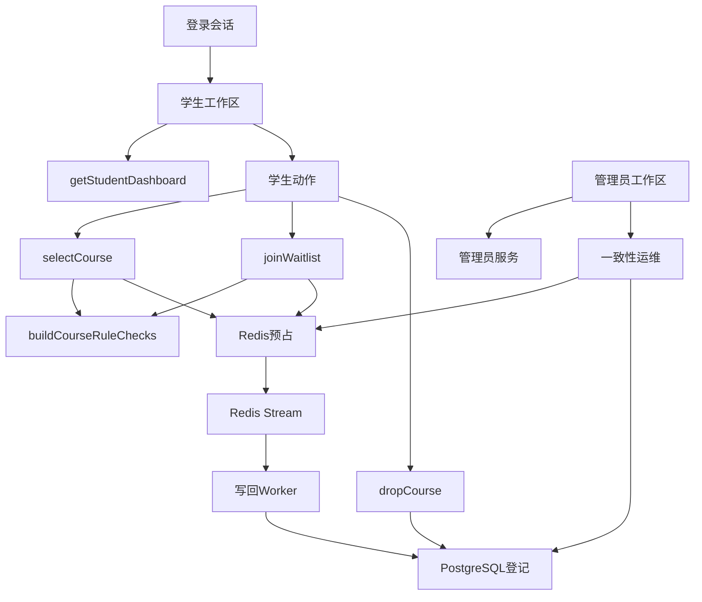

图5.2 核心功能调用链

如图5.2所示，学生端和管理员端虽然页面不同，但核心数据最终汇入Redis和PostgreSQL。学生动作通过服务层进入规则诊断、Redis预占和数据库事务；管理员动作通过服务层进入开课班状态、登记名单和运维快照。这个调用链让实现层与第3章的架构设计一致，也让测试能够绕过页面直接验证服务逻辑。

### 5.3 关键代码分析

关键代码分析选择五类实现：规则诊断构造器、Redis预占脚本、Worker幂等写回、退课递补事务和一致性运维快照。它们分别对应选课系统中最容易出错的五个位置：规则散落、入口竞态、重复写回、候补顺位错乱和异步状态不可见。页面组件虽然也很重要，但真正决定系统可靠性的代码集中在这些服务函数中。

第一类关键代码是buildCourseRuleChecks。它不直接修改数据库，只负责把课程能否选择拆成结构化检查项。开放期检查来自当前学期，课程状态检查来自CourseOffering，课程类型检查来自CourseCategory，适合对象检查来自EligibilityRule和StudentProfile，名额检查来自容量和登记状态，时间检查来自MeetingTime和学生已有登记。每项检查输出稳定code、label、status和detail。这样做的价值在于把规则判断从页面文案中抽离出来。页面只需要根据status显示可以、不能或注意，服务层和测试则可以根据code断言具体规则。

规则诊断还有一个重要细节：它同时服务展示和动作校验。学生在课程详情中看到的选课检查来自同一套规则，点击选课时服务层也使用同一套判断。若展示和提交使用两套逻辑，容易出现页面显示可选、提交后却拒绝的矛盾。当前实现把规则构造集中在服务层，按钮状态、详情Sheet和测试用例都读取同一结构。时间冲突项还会尽量带出冲突课程名，学生能知道冲突来自哪门课，管理员也能在答辩时解释规则来源，避免把业务判断压缩成错误字符串。

第二类关键代码是enrollment-reservations.ts中的Redis预占。reserveActiveSeat和reserveWaitlistSeat使用Lua脚本完成原子动作。正式预占需要检查同一学生是否已有预占，检查正式名额是否小于容量，增加正式预占数，写入reservation记录，追加Stream写回任务。候补预占需要生成候补序号，写入候补reservation，追加候补写回任务。若把这些步骤拆成多个普通命令，多实例并发时可能出现两个请求同时看到剩余名额，再同时写入成功。Lua脚本把判断和写入放到Redis单次执行中，消除这个入口竞态。

Redis预占代码还承担状态过期和重复提交处理。reservationConfig设置预占TTL，避免压测或异常退出后临时状态长期残留。reservationKey和gateKey统一生成键名，保证学生、开课班和闸门可以稳定映射。normalizeReservationResult把Lua返回值整理成服务层可读结果，selectCourse再把结果转换为已入课表、容量满或重复提交。这个分层让Redis脚本保持短小，业务含义在TypeScript层解释，便于测试和维护。

第三类关键代码是enrollment-writeback.ts中的Worker幂等写回。processEnrollmentWritebackBatch从Redis Stream读取任务，writeBackReservation解析任务类型并进入PostgreSQL事务。写回正式登记时，事务先获取开课班锁，再读取开课班、学生和既有登记。若登记已经存在且状态正确，Worker只标记Redis预占确认，不重复插入。若登记存在但状态冲突，Worker会释放或标记失败。若课程已停开或容量最终校验失败，Worker不会强行写入成功。成功路径会写入CourseRegistration、更新enrolledCount、写OperationLog，并在事务完成后确认Redis状态。

幂等写回是异步系统的安全底线。Redis Stream可能重投任务，管理员运维页也允许重投待写回预占，Worker进程重启后也可能再次处理同一任务。若写回逻辑只按任务盲目插入，重复消费会产生重复登记或重复增加enrolledCount。当前实现以学生和开课班的唯一约束作为业务幂等键，以登记状态作为结果判断，以开课班锁保护容量和候补顺位。这些代码把可重复执行作为设计目标，重复消费被纳入正常处理范围。

第四类关键代码是dropCourse和promoteFirstWaitlistedRegistration。退课看似简单，实际包含多个状态迁移。正式登记退课后，系统必须减少已选人数、释放Redis正式预占、查找候补队首、把队首候补改为ACTIVE、恢复已选人数，并记录两条操作日志。若这些动作分散在多个事务中，可能出现正式名额释放但候补没有转入，或候补转入但容量计数错误。当前实现把退课和递补放在同一事务中，并通过开课班锁控制同一开课班内的并发修改。

退课递补还体现了业务规则边界。必修课不能由学生主动退课，名单冻结后不能退课，停开课程由管理员统一移除。退出候补和退正式课也要区分：退出候补只改变本人候补登记，不释放正式名额，也不触发递补；退正式课会释放容量并尝试递补。服务层根据RegistrationStatus和CourseCategory判断路径，避免页面按钮承担业务判断。测试中的退课递补、退出候补、冻结后不可退和必修课不可退都覆盖了这些分支。

第五类关键代码是enrollment-ops.ts中的一致性运维。getEnrollmentOpsDashboard扫描当前学期开课班、Redis gate、Redis reservation和PostgreSQL登记，生成课程维度快照。快照中同时包含入口正式预占、已选待入库、候补待入库、失败预占、最终已选、最终候补和容量校验。resolveOpsStatus根据这些数字给出正常、待写回、需处理或异常。这个服务把Redis短期权威和PostgreSQL最终权威放在同一张表里比较，使管理员能看懂异步中间态。

运维动作也需要谨慎。requeuePendingReservations只重投ACTIVE_RESERVED和WAITLIST_RESERVED，processOpsWritebackBatch复用Worker批处理逻辑，clearFailedReservations只清理FAILED或悬空预占。它们不会清理正常预占或已确认预占。这个边界避免管理员为了恢复系统而误删有效状态。运维服务的意义不在于替代Worker长期运行，而在于给课程设计演示提供可视化恢复入口，也给真实系统留下人工修复思路。

表5.2 关键实现与风险控制

| 关键实现 | 主要风险 | 控制方式 |
| --- | --- | --- |
| 规则诊断 | 页面和提交规则不一致 | 统一结构化检查 |
| Redis预占 | 多实例同时抢超名额 | Lua原子脚本 |
| Worker写回 | 重复消费重复入库 | 幂等键和开课班锁 |
| 退课递补 | 候补顺位或容量错乱 | 同一事务内迁移状态 |
| 运维快照 | 异步状态不可见 | Redis和数据库对照 |

如表5.2所示，关键实现都对应一类具体风险。页面保持轻量，真正的业务判断集中在服务层；Redis负责高峰入口，PostgreSQL保存最终事实；异步写回必须幂等，退课递补必须事务化，运维恢复必须可观察。第7章中的自动化测试和压测正是围绕这些关键代码展开，验证系统在正常点击路径、并发、重复提交、满员、候补、停开和写回积压场景下都能保持可控结果。

## 6 AI辅助开发实践

### 6.1 AI工具使用情况

本项目开发过程中主要使用Codex和ChatGPT两类AI工具。Codex用于本地代码阅读、方案拆解、文件修改、测试错误定位和报告草稿整理。ChatGPT用于前期需求讨论、技术取舍解释和报告表达打磨。AI参与范围覆盖需求分析、领域建模、架构设计、代码实现、测试设计、错误修复、答辩材料整理等阶段，但AI没有替代开发者完成项目边界判断、业务规则确认、依赖安装、命令验证和最终验收。

AI工具使用遵循一个基本原则：先给上下文，再让AI提出可执行方案，最后由开发者确认和验证。开发者向AI提供课程题目、报告模板、老师强调的软件体系结构要求、AGENTS.md约束、本地数据库和Redis环境、依赖安装限制以及命令运行结果。AI在这些上下文中工作，先阅读本地文件，再提出实现计划或报告写作方案。这样可以减少凭空生成内容，也能让AI输出贴合已有代码和课程要求。

表6.1 AI工具使用摘要

| 工具 | 使用阶段 | 主要用途 | 使用频率 |
| --- | --- | --- | --- |
| Codex | 编码、测试、报告 | 读代码、改文件、定位错误、写草稿 | 高频 |
| ChatGPT | 方案讨论、表达梳理 | 需求扩展、技术取舍、报告语言 | 中高频 |
| 本地文档辅助 | 全过程 | 读取模板、规范、组件文档 | 高频 |

如表6.1所示，Codex承担的任务更接近开发协作。它能在同一个工作区中读取项目结构、检查服务层函数、修改报告草稿和维护上下文摘要。ChatGPT更适合开放式讨论，例如课程设计是否显得太简单、是否需要Kafka、如何优化P95延迟、报告某一章如何展开。两类工具结合使用，可以把发散讨论转成文件修改，也可以把运行错误转成下一轮实现任务。

AI使用频率在不同阶段并不相同。需求阶段和架构阶段，AI主要用于提出候选方案和风险点，开发者再根据课程要求裁剪。编码阶段，AI使用频率最高，因为需要反复阅读代码、修改文件、处理类型错误、调整页面语言和补充测试。测试阶段，AI主要帮助解释报错和设计覆盖路径。报告阶段，AI帮助把实现过程整理为符合模板的小节，但章节内容仍以项目真实代码和运行结果为基础。

选择AI工具的原因有三点。第一，本项目涉及Next.js、Prisma、Redis、Better Auth、Nginx、k6和GitHub Actions，技术面较宽，AI能帮助快速建立问题索引。第二，老师强调ICONIX、领域分析和体系结构，AI能把零散功能整理成用例、领域对象、鲁棒对象、时序图和质量属性。第三，课程设计需要报告、测试证据和答辩脚本，AI能帮助把工程过程转成书面材料。开发者的责任是判断哪些建议符合题目边界，哪些建议会增加无必要复杂度。

AI使用过程中也设置了约束。项目要求不擅自安装依赖，不执行破坏环境的命令，依赖安装由开发者手动完成。报告文件不提交Git，代码提交需要细粒度中文提交信息。AI在遇到需要运行命令时，通常由开发者手动执行并反馈结果。这个约束使AI承担分析和实现协作角色，开发者保留环境控制权。

### 6.2 AI参与内容

AI参与的第一类内容是需求澄清和系统边界判断。项目最初题目是基于Next.js的校园在线选课系统，如果只实现课程列表、选课按钮和管理员页面，答辩时会显得功能薄。AI协助分析现实痛点：传统选课系统开选时堵塞、热门课程容量稀缺、学生反复刷新、缺少候补机制、管理员难以追踪名单变化。围绕这些痛点，AI建议把系统边界收敛到选课子域，不扩展完整课程库、教师端和账号生命周期。这个边界由开发者确认，保证功能增强贴着选课业务。

第二类内容是ICONIX建模。开发者明确老师重视ICONIX和领域分析后，AI协助把需求转成用例、领域对象和鲁棒对象。用例层面拆出学生选课、学生加入候补、学生退课、退课自动递补、管理员冻结名单、管理员停开课程、管理员处理写回积压和外部系统获取结果。领域对象层面整理出StudentProfile、CourseOffering、CourseRegistration、EligibilityRule、MeetingTime、OperationLog和Redis Reservation。鲁棒分析层面把学生页面、管理员页面和运维页面归为边界对象，把选课服务、规则诊断构造器、RedisSeatGate、Worker和运维服务归为控制对象。

第三类内容是架构方案讨论。AI最初提出过多种增强方向，例如规则诊断、管理员课程详情、候补功能、Redis预占、CI、Nginx多实例和大规模压测。开发者继续追问是否需要Kafka、Redis预占后能否直接显示成功、是否需要独立Worker、是否只异步处理候补。经过多轮讨论，最终选择Redis预占加独立Worker，不引入Kafka；正式选课和候补拆成两个用例；学生端不显示候补顺位；Redis作为短期入口状态，PostgreSQL作为最终登记和审计存储。AI在这里提供方案空间，开发者负责做取舍。

第四类内容是代码实现。AI根据本地代码结构修改Prisma模型、服务层、页面组件、脚本和测试。候补功能实现时，AI协助扩展RegistrationStatus和OperationType，增加waitlistedAt和waitlistPosition，修改selectCourse、joinWaitlist、dropCourse和管理员统计。Redis预占实现时，AI协助编写预占服务、写回Worker、运维服务和压测脚本。管理员控制台拆分时，AI协助新增window、stats、logs和ops工作区。前端重构时，AI协助使用Tabs、Table、Badge、Progress、Sheet、Tooltip和Empty表达状态。

第五类内容是错误定位。开发者把实际命令输出反馈给AI，AI根据报错定位具体原因。例如Prisma 7不再支持在schema中配置datasource url，需要迁移到prisma.config.ts和运行时适配器；Better Auth构建时需要配置密钥和基础地址；PostgreSQL advisory lock查询返回void会触发Prisma反序列化错误，需要改成可反序列化结果；Next.js经过Nginx转发时需要保留带端口的Host，避免Server Actions校验失败；GitHub Actions中需要显式执行Prisma generate；k6 inspect不能依赖压测目标文件，应把目标校验放到运行阶段。

第六类内容是测试设计和报告证据。AI协助把测试范围从少量手工点击扩展为单元测试、集成测试、Worker写回测试、运维测试、Allure报告、覆盖率报告和k6压力测试。测试用例覆盖时间冲突、密码哈希、Redis缓存、专业选修、重复选课、满员候补、候补顺位、候补冲突、退课递补、管理员详情、停开含候补课程、写回幂等和运维恢复。AI还协助把这些测试证据整理到artifacts目录和报告第7章中，使测试章节能呈现可执行证据。

第七类内容是界面语言和报告写作。开发者指出页面表头和课程详情中的词语不好懂，AI协助把内部枚举和技术词转成业务可读表达，例如把规则改为选课检查，把有效改为已选，把移除解释为停开移除，把Redis待写回状态改成已选待入库和候补待入库。报告写作阶段，AI按照模板逐章重写第1章到第5章，减少空话和宽表，增加业务问题、技术设计、实现证据和结果分析。第6章本身也属于AI辅助写作的记录，但内容必须基于真实开发过程。

AI参与并不等于无差别采纳。开发者多次否定或调整AI建议。例如不实现教师端，不实现完整课程库维护，不引入Kafka，不把候补做成学生端复杂排队展示，不在报告中生成Word文件，不把报告提交到Git。这些决定保留了项目重点：选课高峰、候补递补、名单追踪、异步一致和测试证据。

表6.2 AI参与阶段与人工审核点

| 阶段 | AI参与 | 人工审核重点 |
| --- | --- | --- |
| 需求分析 | 提炼痛点和用例 | 是否符合课程题目 |
| 架构设计 | 提出候选方案 | 是否控制复杂度 |
| 代码实现 | 修改服务和页面 | 是否通过构建测试 |
| 调试修复 | 分析报错原因 | 是否匹配真实版本 |
| 报告写作 | 组织章节内容 | 是否基于项目事实 |

如表6.2所示，AI参与越深入，人工审核越不能省略。需求范围、架构取舍、依赖安装、命令结果和报告事实都需要开发者最终确认，AI只能作为协作工具进入工程流程。

### 6.3 使用效果与反思

AI带来的第一项效果是提高需求展开速度。课程题目只有基于Next.js的校园在线选课系统，如果从零开始人工梳理，容易停留在学生选课和管理员管理两个页面。AI帮助把现实痛点拆成开选拥堵、容量竞争、候补缺失、名单追踪和测试证据，再把这些痛点映射到规则诊断、候补状态机、Redis预占、Worker写回、管理员运维和压测报告。这样，项目扩展围绕选课业务的核心矛盾展开，避免依靠花哨功能堆叠。

第二项效果是提高设计材料组织效率。ICONIX方法要求用例文本、领域模型、鲁棒分析、时序图和结构设计之间有连续关系。AI擅长把对话中零散出现的业务规则整理为模型材料。例如候补功能讨论中，AI把WAITLISTED归入CourseRegistration生命周期，把Redis Reservation解释为短期领域状态，把RedisSeatGate和EnrollmentWritebackWorker识别为控制对象。这样报告能够说明功能从领域分析落到结构设计，避免停留在临时按钮层面。

第三项效果是加快错误定位。项目使用的技术版本较新，错误往往来自框架细节。Prisma 7的数据源配置变化、Better Auth默认密钥限制、Next.js Server Actions转发头校验、k6 inspect执行setup阶段、Redis Stream写回重复消费，这些问题如果只靠搜索和试错会耗费较多时间。AI能根据报错文本快速提出可能原因，再由开发者运行命令验证。这个流程把调试从盲目尝试变成有方向的排查。

第四项效果是推动测试和证据建设。AI提醒项目不能只靠页面演示，需要把自动化测试、覆盖率、Allure报告、k6压测、数据库一致性摘要和GitHub Actions CI纳入材料。最终测试从单一功能点击扩展为42个自动化用例、覆盖率报告、Worker写回测试、运维恢复测试和压测脚本。对课程设计而言，这些证据能说明系统经过验证，也能支撑软件体系结构课程对质量属性的要求。

AI的第一类局限是可能扩大范围。它很容易建议Kafka、教师端、完整课程库、通知系统、候补调序和更多运维能力。这些功能单独看都有价值，但课程设计需要围绕选课子域形成清晰主线。开发者必须把增强分成两类：一类能支撑容量一致、候补递补、名单追踪和测试证据；另一类会转移主题或增加部署负担。最终项目保留Redis预占、候补、运维、压测和CI，舍弃Kafka、教师端和完整课程库维护。

AI的第二类局限是可能忽略本地版本和项目约束。AI生成的代码如果没有读取本地文件，容易使用过时API或不存在的组件。项目中曾遇到Prisma Client未生成、Nginx转发头不匹配、Better Auth缺少密钥、k6目标文件缺失等问题。解决这些问题依赖真实命令输出，模型给出的判断只能作为排查线索。开发者需要运行构建、测试和页面验证，把AI建议转化为可运行结果。

AI的第三类局限是语言容易偏技术术语。系统实现中出现过Redis入口、待写回、有效登记、移除等词，开发者指出控制台和课程详情不好懂后，才进一步改成已选、候补、停开移除、已选待入库等表达。这个过程说明AI能生成技术正确的内容，但用户界面和报告正文还需要从读者角度审视。课程设计面向教师评审，语言既要专业，也要让人一眼理解业务含义。

开发者必须承担最终责任。系统边界由开发者决定，业务规则由开发者确认，依赖安装和命令运行由开发者控制，Git提交由开发者审查，报告中的结论也必须和真实代码一致。AI可以提出方案、生成草稿、修改文件和解释错误，但它不能替开发者保证方案适合课程要求，也不能替开发者证明系统已经通过测试。每次AI修改后，都需要通过代码差异、构建结果、测试结果或页面行为来验证。

本项目形成了一种可复用的AI协作流程。第一步，开发者提供模板、代码、运行环境和约束。第二步，AI提出计划或修改。第三步，开发者执行命令或浏览页面，反馈结果。第四步，AI根据真实反馈修正实现和报告。第五步，把稳定结论记录到course-reports中，方便后续会话继续。这种流程让AI输出保持在工程上下文中，也让开发者持续掌握决策权。

从反思角度看，AI时代的软件开发能力不只体现在会让AI写代码。更重要的是能提出具体问题，能判断建议是否符合领域模型，能把复杂方案压回合适边界，能用测试和运行证据审查结果。本项目中，AI提高了效率，开发者负责方向；AI拓展了方案，开发者负责取舍；AI生成了实现，测试负责验收。这种关系比单纯把AI当作代码生成器更可靠，也更符合软件工程课程强调的分析、设计、实现和验证闭环。

## 7 系统测试

### 7.1 测试环境

测试环境的设计目标是尽量接近系统真实运行结构。这个项目的核心风险不在页面能否渲染，而在选课规则、数据库事务、Redis预占、异步写回和多实例入口能否共同保持一致。因此测试环境必须同时包含Web应用、PostgreSQL、Redis、Worker、Nginx、自动化测试工具和压测工具。若只用内存模拟数据，无法发现Prisma连接、Redis Stream、数据库锁、Nginx转发头和Server Actions校验等真实问题。

本地环境运行在Windows开发机。PostgreSQL通过Docker容器暴露在127.0.0.1:5432，Redis通过Docker容器暴露在127.0.0.1:6379。Next.js应用使用pnpm启动，Prisma连接PostgreSQL，Redis客户端连接本地Redis。Better Auth负责登录会话。压测场景下，k6通过HTTP接口访问应用；水平扩展场景下，请求先进入Nginx，再分发给多个Next.js实例。Worker作为独立进程消费Redis Stream，把预占结果写入PostgreSQL。

表7.1 测试环境摘要

| 项目 | 内容 |
| --- | --- |
| 操作系统 | Windows开发环境 |
| Web框架 | Next.js 16.2.9，React 19.2.4 |
| ORM与认证 | Prisma 7.8.0，Better Auth 1.6.22 |
| 数据库 | PostgreSQL Docker容器，端口5432 |
| 缓存与队列 | Redis Docker容器，端口6379 |
| 自动化测试 | Vitest 4.1.9，Allure，覆盖率报告 |
| 压测与部署 | k6，Docker Compose，Nginx |

如表7.1所示，测试环境覆盖了系统运行依赖。PostgreSQL负责最终名单、资格规则、操作日志和容量计数；Redis负责缓存、限流、正式预占、候补预占和写回任务；Next.js负责页面和接口；Worker负责异步写回；Nginx负责多实例入口。测试环境把这些组件同时纳入，才能验证第3章提出的架构设计。

测试数据来自Seed脚本和压测准备脚本。Seed脚本生成学生、管理员、学院、专业、课程、开课班、必修课、专业选修课、公选课、低容量课程和时间冲突课程。压测准备脚本额外生成压测学生和专用抢课课程，例如高并发选课演练课程。这样，普通功能测试和压力测试不会混用同一批业务数据。报告和答辩中可以分别展示演示课程、低容量课程、冲突课程和压测课程。

集成测试直接连接开发库。测试执行前需要确保PostgreSQL和Redis可用，Prisma Client已经生成，数据库结构已同步，环境变量包含数据库地址、Redis地址、Better Auth地址、认证密钥和结果接口密钥。由于多个集成测试文件会重置数据并共享同一个开发库，Vitest配置需要避免测试文件并行清库。这个限制来自真实数据库测试的特性，也说明集成测试比纯单元测试更接近系统运行状态。

测试产物统一放在artifacts目录。Allure结果、Allure HTML报告、覆盖率HTML报告、k6 HTML报告、k6 JSON摘要、压测目标文件和压测后一致性摘要都放入该目录。报告正文引用这些产物，答辩时可以截图展示。这样做的好处是测试结果不散落在终端历史中，而能形成可保存、可复查、可展示的证据包。

### 7.2 测试方案

测试方案从风险出发，工具只承担验证手段。系统最关键的风险有五类：规则判断错误、容量超卖、候补顺位错乱、异步写回丢失、部署入口异常。对应地，测试策略分为单元测试、服务层集成测试、异步写回测试、一致性运维测试、系统构建检查、浏览器手动验收和压力测试。每一层都服务不同风险，互相补充。

第一层是单元测试，验证纯函数和工具函数。时间冲突算法是选课规则的基础，必须覆盖同星期节次重叠、不同星期、教学周不重叠、边界相邻等情况。密码哈希测试覆盖正确密码、错误密码、坏格式哈希和派生密钥长度异常，保证登录工具函数经过验证。缓存测试覆盖Redis缓存读取、写入、失效和异常吞掉分支，避免缓存层错误影响主流程。

第二层是服务层集成测试。学生选课、重复选课、满员候补、候补顺位、候补参与时间冲突、退课自动递补、退出候补、管理员详情、冻结名单、停开课程都在这一层验证。这些测试直接调用服务层，连接真实PostgreSQL和Redis，比浏览器点击更稳定，也能检查数据库状态和Redis状态。服务层测试能证明规则和状态迁移正确，页面只负责展示这些结果。

第三层是异步写回和一致性运维测试。Redis预占架构引入Stream任务、Worker幂等写回、失败释放、待写回扫描和重投处理。测试直接构造Redis预占和Stream任务，验证Worker能写入有效登记或候补登记，也能在状态冲突和停开课程时释放预占。运维测试验证管理员处理写回后，待写回数量下降，数据库登记产生，失败或悬空预占可以清理。

第四层是构建和静态检查。Prisma校验用于检查schema和配置，Prisma生成用于确保客户端类型存在，ESLint用于发现导入和代码规范问题，Next build用于验证生产构建、Server Components、Server Actions和类型检查。这一层关注代码能否以生产模式构建，不承担具体业务用例验证。很多问题只在构建阶段暴露，例如Better Auth密钥、环境变量、服务端组件导入和Prisma Client生成。

第五层是系统级手动验收。学生端需要验证登录、课程列表、课程详情、选课检查、正式选课、候补、退课、课表矩阵和按钮状态。管理员端需要验证开放期、课程统计、课程详情、名单追踪、冻结、停开、日志、运维页、CSV导出和结果API。手动验收不能替代自动化测试，但能发现页面布局、文案、交互跳转和浏览器行为问题。

第六层是压力测试。k6模拟多学生同时抢课、满员后显式候补和单账号高频重复提交。压测不只看HTTP状态码，因为容量满、重复提交和规则拒绝属于系统正常处理结果。脚本把正式入选、候补入队、容量满、忙碌拒绝、重复提交、时间冲突、规则拒绝、限流、鉴权拒绝和服务错误分开统计。这样才能解释压测结果背后的业务含义。

表7.2 测试层次与验证目标

| 层次 | 验证目标 | 代表证据 |
| --- | --- | --- |
| 单元测试 | 纯函数和工具函数正确 | 时间冲突、密码、缓存测试 |
| 集成测试 | 业务状态迁移正确 | 选课、候补、递补、停开测试 |
| 异步测试 | Redis预占能最终落库 | Worker和运维测试 |
| 构建检查 | 生产构建可用 | Prisma、ESLint、Next build |
| 压力测试 | 高峰入口可控 | k6报告和一致性摘要 |

如表7.2所示，测试层次与系统风险逐一对应。单元测试守住算法和工具函数，集成测试守住业务状态，异步测试守住Redis到PostgreSQL的写回，构建检查守住生产可运行，压力测试守住高峰入口。

测试准入标准包括：PostgreSQL和Redis可访问，数据库结构已同步，Prisma Client已生成，Seed数据可重置，环境变量配置完整，测试脚本和压测目标文件准备完成。测试准出标准包括：Vitest全量通过，ESLint无错误，Next build通过，核心压测服务错误为0，数据库有效登记不超过课程容量，课程enrolledCount与有效登记数量一致。

测试优先级按照业务风险排序。容量不超卖、候补递补、时间冲突、停开移除和Worker幂等写回优先级最高，因为它们直接影响业务正确性。页面展示和文案属于中高优先级，因为答辩演示依赖页面可理解性。限流和Nginx多实例属于扩展质量验证，优先级也较高，因为它们支撑系统架构说明。

### 7.3 测试用例与结果

自动化测试覆盖从算法到服务再到异步写回的主要路径。当前覆盖率报告记录测试文件7个、测试用例42个，语句覆盖率89.09%，分支覆盖率72.05%，函数覆盖率91.24%，行覆盖率89.68%。Allure报告记录16个核心业务用例通过，包括专业选修成功、重复选课拒绝、并发不超卖、规则诊断、满员候补、候补顺位、候补冲突、退课递补、管理员详情和停开含候补课程等。

用例结果可以按业务链路说明。时间冲突算法由schedule测试验证，覆盖重叠星期、重叠节次、重叠周次和不重叠边界。专业选修成功、重复选课拒绝、必修课冲突、规则诊断和并发抢最后名额由选课集成测试验证。测试会检查登记状态、容量计数和错误类型，确保页面显示和数据库状态一致。

候补相关用例集中验证WAITLISTED状态的生命周期。满员候补用例验证第二名学生加入候补后产生候补登记，已选人数不增加。候补顺位用例验证多名学生候补同一课程时顺位递增。候补参与冲突用例验证候补课程也占用意向课表，学生不能再选择同时间课程。退课自动递补用例验证有效学生退课后，队首候补转为有效登记，容量计数保持一致。退出候补用例验证候补学生退出后只改变本人状态，不触发递补。

管理员和异步架构用例分布在管理员测试、写回测试和运维测试中。管理员测试验证课程详情能返回登记名单和相关日志，也验证停开含候补课程时，有效和候补登记统一变为停开移除。写回测试验证Worker能消费Redis预占任务，幂等写入有效或候补登记，遇到状态冲突或停开课程时释放预占。运维测试验证一致性运维服务能扫描待写回、重投任务、处理一批写回，并清理失败或悬空预占。

表7.3 典型测试用例摘要

| 编号 | 测试目标 | 实际结果 |
| --- | --- | --- |
| TC01 | 时间冲突算法识别重叠和边界 | 通过 |
| TC02 | 符合规则的专业选修可选 | 通过 |
| TC03 | 重复选课不增加容量 | 通过 |
| TC04 | 并发抢最后名额不超卖 | 通过 |
| TC05 | 满员后显式候补生成WAITLISTED | 通过 |
| TC06 | 退课后队首候补自动转入 | 通过 |
| TC07 | 停开课程移除有效和候补登记 | 通过 |
| TC08 | Worker重复写回保持幂等 | 通过 |
| TC09 | 运维处理待写回能落库 | 通过 |

如表7.3所示，用例覆盖正常情况、异常情况和边界情况。正常情况包括符合规则的专业选修成功和管理员详情查询；异常情况包括重复选课、时间冲突、冻结后不可退和停开课程；边界情况包括容量为1的抢课、候补队首递补和Redis写回重复消费。这样的用例组合能证明系统核心规则已经被自动化测试覆盖。

表7.4 覆盖率结果

| 指标 | 覆盖结果 |
| --- | --- |
| 语句覆盖率 | 89.09%，483/587 |
| 分支覆盖率 | 72.05%，250/390 |
| 函数覆盖率 | 91.24%，118/137 |
| 行覆盖率 | 89.68%，473/572 |

如表7.4所示，当前自动化测试已经覆盖大多数语句、函数和行，分支覆盖率则提示异常路径还有继续补强空间。

【截图占位：Allure概览页，展示核心用例全部通过】

图7.1 Allure自动化测试概览

如图7.1所示，Allure报告适合展示核心业务用例的执行结果。答辩时可以用该图说明测试结果已经形成可查看、可归档的证据，不只停留在终端历史中。

【截图占位：覆盖率HTML首页，展示语句、分支、函数和行覆盖率】

图7.2 覆盖率HTML报告首页

如图7.2所示，覆盖率报告把测试覆盖范围转成具体指标。它能辅助说明哪些模块已经得到较充分验证，也能暴露后续需要补充的异常分支。

覆盖率结果说明服务层和工具函数已经得到较充分验证。分支覆盖率低于语句覆盖率，主要原因是错误处理分支、异常兜底和少量部署相关路径不容易在单次测试中全部触发。后续可以继续补充API鉴权失败、Redis连接异常、管理员非法时间范围、结果接口密钥错误等分支测试。覆盖率不应被看作唯一目标，它的价值在于帮助发现尚未验证的风险路径。

压力测试主方案为1000名学生抢100个名额。正式答辩前建议使用Nginx入口运行该规模压测，并用Worker和汇总脚本确认最终登记。当前已有一次200名学生抢30个名额的中间证据：k6记录总请求200，P95延迟781.5ms，容量满响应170，服务错误0，Redis正式预占30。该结果能证明Redis入口在并发场景下能把30个正式名额和170个容量满结果区分开，并且没有服务端错误。若答辩前完成1000抢100，可将表7.5中的数据替换为最终结果。

表7.5 压测结果摘要

| 指标 | 当前记录 |
| --- | --- |
| 压测模式 | 多学生同时抢课 |
| 并发学生数 | 200 |
| 课程容量 | 30 |
| 总请求数 | 200 |
| 正式预占 | 30 |
| 容量满响应 | 170 |
| 服务错误 | 0 |
| P95延迟 | 781.5ms |

压力测试后还需要数据库一致性校验。入口预占成功只说明Redis闸门正确，最终报告还要说明Worker写回后PostgreSQL中的ACTIVE登记不超过容量，enrolledCount等于ACTIVE数量，候补登记不占正式名额。汇总脚本会读取Redis闸门和PostgreSQL登记，生成压测校验摘要。这个步骤把性能测试和数据一致性测试连接起来，避免压测只看接口响应速度。

【截图占位：k6主压测HTML报告，展示请求数、P95延迟、正式预占和服务错误】

图7.3 k6主压测HTML报告

如图7.3所示，k6报告用于展示多学生抢课时的请求规模、P95延迟、业务响应分类和服务错误。该图可以和表7.5一起说明Redis预占入口在高并发场景下的表现。

【截图占位：压测后一致性摘要，展示有效登记不超过容量和计数一致】

图7.4 压测后一致性摘要

如图7.4所示，一致性摘要用于证明压测后数据库没有超卖，课程已选人数和有效登记数量保持一致。它补足了压力测试只看接口响应的不足。

### 7.4 问题分析与改进

测试和运行中暴露的问题可以分为四类：工具链版本问题、数据库和ORM边界问题、并发一致性问题、部署和脚本问题。问题分析需要说明每个问题为什么会发生、系统如何修复、修复后用什么证据验证，避免停留在报错罗列。

第一类是工具链版本问题。Prisma 7不再支持在schema文件中配置datasource url，早期执行Prisma校验时报错。原因是Prisma 7把连接配置迁移到prisma.config.ts和运行时适配器。修复方案是移除schema中的连接串，在Prisma配置文件中提供CLI连接，在运行时通过PostgreSQL适配器创建PrismaClient。修复后，Prisma校验、Prisma生成、Seed脚本和集成测试可以通过。GitHub Actions中找不到Prisma Client也属于这一类，解决方法是在CI中显式生成客户端，再执行迁移和测试。

第二类是数据库函数和ORM适配器边界问题。服务层曾使用PostgreSQL advisory lock函数获取事务锁，但该函数返回void列，Prisma适配器无法反序列化，页面选课时报错。修复方案是学生重复提交锁使用可返回布尔值的尝试锁，开课班排队锁把锁函数结果转换成可序列化文本。这个问题说明底层数据库函数即使语义正确，也要考虑ORM如何读取返回值。修复后，学生点击课程不再触发反序列化错误，集成测试也能覆盖加锁路径。

第三类是并发一致性问题。同步写数据库方案在抢最后名额时容易出现写冲突或死锁，P95延迟也会因数据库排队升高。项目先用学生锁和开课班锁降低事务冲突，后续进一步把正式选课入口改为Redis预占。Redis Lua脚本负责入口原子判断，Worker负责最终写回，PostgreSQL事务负责最终登记一致。并发不超卖测试和k6压测用于验证修复效果。压测结果显示200抢30场景下正式预占30、容量满170、服务错误0，说明入口没有超发正式名额。

第四类是部署和脚本问题。Nginx多实例入口曾出现502和Server Actions请求头不一致。502来自应用容器启动参数错误，Server Actions错误来自Nginx转发时没有保留带端口的Host。修复后，Next.js应用以正确主机和端口启动，Nginx使用浏览器原始Host和X-Forwarded-Host转发请求。k6 inspect曾因缺少压测目标文件失败，修复后把目标课程校验放到运行阶段，使CI能静态检查脚本结构，真实压测时再要求先生成目标数据。

表7.6 典型问题与修复

| 问题类型 | 代表问题 | 修复结果 |
| --- | --- | --- |
| 工具链版本 | Prisma 7连接配置变化 | 迁移到配置文件和运行时适配器 |
| 数据库边界 | advisory lock返回void | 改成可序列化返回值 |
| 并发一致 | 同步写库P95偏高 | Redis预占加Worker写回 |
| 部署配置 | Nginx转发头不一致 | 保留带端口Host |
| 脚本检查 | k6 inspect缺少目标文件 | 目标校验移到运行阶段 |

如表7.6所示，这些问题也推动了测试方案完善。Prisma问题促使CI显式生成客户端；锁函数问题促使选课路径加入集成测试；并发问题促使压测从单用户重复提交升级为多学生抢课；Nginx问题促使健康检查和多实例入口纳入验收；k6问题促使压测脚本区分静态检查和真实运行。每个问题都转化为后续测试清单的一部分。

后续改进可以从三个方向展开。第一，补充更多异常分支测试，例如Redis临时不可用、API Key错误、管理员非法时间范围、Worker中途失败后恢复。第二，把1000抢100压测作为答辩前固定证据，并补充Worker写回后的数据库一致性截图。第三，在CI中增加更完整的可视化报告归档，把Allure、覆盖率和k6摘要作为构建产物保存。这样，第7章的测试材料就能从本地验证进一步提升到可持续验证。

## 8 项目管理与过程记录

### 8.1 项目计划

项目计划按三周课程设计节奏制定，时间安排围绕任务风险分配。选课系统的难点集中在需求边界、领域建模、并发一致性和测试证据，因此计划采用逐层推进方式：先确定系统边界和领域对象，再实现可运行的选课主流程，随后围绕候补、并发、运维和测试补强，最后整理报告和答辩材料。这样的计划能避免一开始就被细节淹没，也能避免后期发现系统只剩页面演示、缺少工程证据。

第一阶段是分析与建模。该阶段目标是回答系统做什么、谁使用系统、哪些业务属于本系统、哪些业务交给外部教务主系统。项目将系统边界限定在选课子域：外部系统提供学生、专业、课程和必修课基础数据，本系统负责开放期内的选课、候补、退课、名单冻结、课程停开、结果导出和日志追踪。该阶段还要完成用例模型、领域模型和关键业务流程分析，为后续数据库和服务层设计提供依据。

第二阶段是基础功能实现。该阶段目标是让系统形成最小可运行闭环，包括登录、学生课程列表、选课、退课、管理员统计、开放期管理、Prisma模型和Seed数据。这个阶段不追求复杂并发优化，重点是让学生、管理员和数据库之间形成稳定链路。完成后，系统已经能演示基本选课，但答辩工作量和体系结构深度仍不足。

第三阶段是业务深度补强。该阶段围绕选课系统真实痛点增加功能：规则诊断让学生知道为什么能选或不能选，管理员课程详情让名单变化可追踪，候补状态机解决满员后无队列问题，课表矩阵展示正式和候补课程的时间占用。这些功能都服务选课业务本身，没有扩展到教师端、完整课程库或培养方案维护。

第四阶段是架构与性能补强。同步写库方案在高并发入口下容易拉高P95延迟，项目将正式选课入口改为Redis预占和Worker异步写回。管理员端增加一致性运维工作区，观察Redis短期预占、待写回任务和PostgreSQL最终登记之间的关系。该阶段同时引入k6压测、多学生抢课数据准备脚本、压测结果汇总脚本和Nginx多实例部署。

第五阶段是质量和报告收尾。项目补充Vitest测试、Allure报告、覆盖率报告、GitHub Actions、Docker构建、健康检查接口、答辩脚本和课程设计报告草稿。报告在实现过程中同步沉淀，将前面形成的用例、领域模型、时序图、部署图、测试证据和问题记录整理成完整材料。这个阶段的目标是让系统有可运行结果，也有可解释证据。

表8.1 项目阶段安排

| 阶段 | 主要任务 | 交付结果 |
| --- | --- | --- |
| 分析建模 | 需求边界、用例、领域模型 | ICONIX材料 |
| 基础实现 | 登录、选课、管理员统计 | 可运行主流程 |
| 业务补强 | 规则诊断、候补、课表矩阵 | 选课子域完整化 |
| 架构补强 | Redis预占、Worker、Nginx | 高并发与水平扩展 |
| 质量收尾 | 测试、压测、报告、答辩 | 可验证证据包 |

如表8.1所示，项目阶段安排从分析、实现、补强到验证逐步推进。这样的阶段划分能保证早期先跑通主流程，后期再把候补、并发、部署和报告证据补充完整。

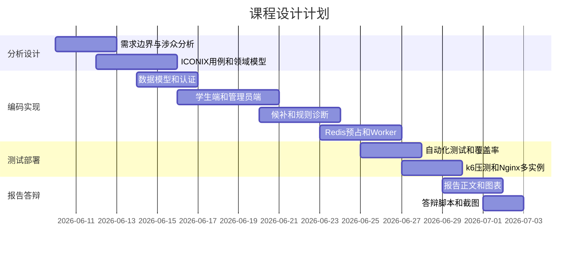

图8.1 项目计划甘特图

图8.1展示了三周左右的任务安排。前半段强调分析设计和主流程实现，后半段强调候补、并发、测试、部署和报告。实际开发中，部分任务存在交叉，例如规则诊断、候补和Redis预占实现后，同步整理了对应的建模记录、时序图和测试证据。这样可以减少最后集中补文档时出现代码与报告不一致的风险。

计划中的关键里程碑包括：Prisma模型可验证，学生能登录并查看课程，管理员能查看统计，选课规则可诊断，候补能入队和递补，Redis预占能降低入口延迟，Worker能写回最终登记，运维页能展示一致性，自动化测试和压测能产出可视化证据。每个里程碑都对应报告中的分析、设计或测试材料。若某个里程碑无法验证，例如Worker不能写回最终登记，则后续压测和管理员运维证据也会受影响，因此里程碑之间存在依赖关系。

项目计划还预留了风险缓冲。依赖版本风险集中在Next.js、Prisma和Better Auth，预留时间处理构建和运行错误。并发一致性风险集中在选课入口和递补事务，预留时间写集成测试和k6脚本。报告风险集中在空泛描述，预留时间把代码事实整理成图表和证据。项目规模风险也需要控制，教师端、完整课程库和通知系统虽有价值，但会稀释选课子域主线，因此列入未来改进。

任务安排还考虑到答辩演示。系统必须有可控演示数据，因此Seed脚本和压测脚本被纳入计划；系统必须能解释设计，因此ICONIX材料和时序图被纳入计划；系统必须能证明质量，因此Allure、覆盖率、k6和CI被纳入计划。这样，项目计划围绕课程设计评分点组织交付物，超出了普通开发排期的范围。

### 8.2 开发过程记录

开发过程与最初计划相比，呈现出逐步加深的特点。项目起点是一个基于Next.js的校园在线选课系统，但在讨论和实现过程中，系统从普通课程选择页面演进为包含规则诊断、候补状态机、Redis预占、异步写回、管理员运维、自动化测试和水平扩展部署的工程化作品。这个过程通过多轮验收发现短板，再围绕选课核心问题补强。

第一组关键事件是需求和系统边界确认。开发者先阅读课程设计报告模板、软件体系结构作品要求和项目约束，明确报告需要覆盖需求分析、系统分析、系统设计、实现、AI实践、测试和项目管理。系统边界随后确定为选课子域：学生档案、课程和必修课由外部教务系统预置，本系统处理开放期内的选课、候补、退课、名单冻结、课程停开和结果交付。这个边界决定了后续不实现教师端和完整课程库维护。

第二组关键事件是基础系统搭建。项目建立Prisma模型、Better Auth认证、Seed数据、学生页面、管理员页面、选课服务和课表冲突测试。学生可以登录并查看课程，管理员可以进入后台查看统计，系统可以完成基本选课和退课。此时主流程已经可运行，但答辩观感偏简单，难以充分体现三周课程设计的工作量和软件体系结构知识。

第三组关键事件是业务规则补强。项目增加学生端规则诊断，将开放期、课程状态、课程类型、适合对象、名额和上课时间转成结构化选课检查。管理员端增加课程详情和名单追踪，能查看已选、候补、退课、停开移除和相关日志。Seed数据增加低容量课程和时间冲突课程，便于演示满员、候补、冲突和课表扩展。学生端课表矩阵展示星期一到星期日每一节课的占用情况。

第四组关键事件是候补状态机实现。系统将WAITLISTED加入CourseRegistration生命周期，增加候补时间和候补顺位。服务层实现显式候补、退出候补、退课递补和停开课程统一移除。学生课表矩阵展示正式和候补课程，管理员详情展示候补名单和日志。对应测试覆盖满员候补、候补顺位、候补参与时间冲突、退课自动递补和停开含候补课程。该阶段使系统从普通选课扩展为能处理满员后排队和递补的业务系统。

第五组关键事件是性能方案演进。早期同步写PostgreSQL方案逻辑清楚，但多学生抢课时P95延迟偏高。项目先分析是否需要Kafka，最终选择Redis预占加独立Worker异步写回。正式选课通过Redis Lua脚本快速生成预占，Worker消费Redis Stream写回PostgreSQL。管理员新增一致性运维工作区，展示已选待入库、候补待入库、失败预占和最终登记。压测脚本从单用户重复提交升级为多学生真实抢课。

第六组关键事件是工程化证据补强。项目增加Allure报告、覆盖率报告、k6压测报告、Nginx多实例部署、健康检查接口、Dockerfile、docker-compose.lb.yml和GitHub Actions。CI执行Prisma校验、迁移、测试、ESLint、Next构建、k6脚本检查和Docker构建。报告材料同步整理到course-reports，包括ICONIX建模、时序图、部署结构、测试证据和答辩脚本。

表8.2 开发过程里程碑

| 里程碑 | 主要成果 | 验证方式 |
| --- | --- | --- |
| 边界确认 | 选课子域和外部系统边界 | 用例模型和领域模型 |
| 基础系统 | 登录、课程列表、选课、管理员统计 | 页面演示和基础测试 |
| 规则补强 | 规则诊断、课程详情、课表矩阵 | 页面验收和集成测试 |
| 候补状态机 | 候补、退出候补、退课递补 | 候补集成测试 |
| 高并发优化 | Redis预占、Worker写回、运维页 | k6压测和运维测试 |
| 工程证据 | Allure、覆盖率、CI、Nginx | 报告截图和CI结果 |

如表8.2所示，开发过程呈现迭代推进特点。每个里程碑后，项目通过测试和演示发现短板，再围绕选课业务继续补强。

开发过程也体现了计划与实际的偏差。最初没有完全确定Redis预占和Nginx多实例，候补功能也是在讨论系统显得过于简单后才加入。后续发现同步写库压测P95不理想，才进一步引入Redis预占和Worker。这个变化属于迭代开发中的正常调整。关键在于每次调整都围绕选课业务痛点展开，并最终补充到模型、实现、测试和报告中。

Git提交记录也反映了项目演进。从候补状态机、管理员页面拆分、可视化测试、压测脚本、Redis预占、运维工作区，到CI、Nginx部署和覆盖率补强，提交信息基本按功能和问题分组。这样的记录有助于回顾项目推进路径，也便于在出现问题时定位是哪一类改动引入了变化。报告文件本身不提交Git，避免把草稿改动和代码演进混在一起。

### 8.3 风险与问题处理

风险管理贯穿整个项目。课程设计项目规模不大，但技术栈包含Next.js、Prisma、PostgreSQL、Redis、Better Auth、Nginx、Docker、k6和GitHub Actions，任何一处版本、配置或业务规则变化都可能影响演示。风险处理原则是尽早暴露、分类处理、验证闭环、记录到报告中。问题不只在终端里修掉，还要转化为测试用例、配置说明或答辩备用路径。

第一类风险是需求发散。选课系统天然可以扩展教师端、培养方案、课程库维护、通知系统、审批系统和成绩系统。若这些功能全部加入，项目会失去主线，也难以在三周内形成稳定作品。处理方案是明确系统边界，只实现选课子域中能体现规则、状态、并发和追踪的功能。教师端、完整课程库和账号生命周期列为未来改进。这样既保证工作量充足，也避免功能发散。

第二类风险是性能风险。开选瞬间大量学生同时提交，早期同步写库方案容易让请求排队，P95不理想。处理方案是Redis预占加Worker写回，入口只做快速规则检查和原子预占。压测报告关注正式预占数、容量满响应、服务错误和数据库最终一致。若本机资源不足，可以调整压测规模，但架构设计保持不变。正式答辩前建议用1000名学生抢100个名额生成最终压测证据。

第三类风险是一致性风险。Redis预占成功后，PostgreSQL还没有最终登记，这会产生中间状态。处理方案是引入Reservation临时状态、Redis Stream、幂等Worker和一致性运维工作区。管理员可以看到待写回，触发处理写回，也可以清理失败预占。测试中直接构造Redis预占验证Worker和运维服务。这个风险通过运维页面变成可观察对象。

第四类风险是依赖版本和配置风险。Prisma 7连接配置变化、Better Auth构建密钥要求、Next.js Server Actions转发头校验、k6 inspect目标校验都在开发中出现。处理方案是保持命令验证闭环，所有关键改动后运行校验，并把问题原因和修复记录写入测试章节。CI中显式生成Prisma Client，Nginx转发保留带端口的Host，k6脚本把目标校验放到运行阶段，都是这类风险的具体处理结果。

第五类风险是测试环境污染。学生选课、候补、退课、压测和运维处理都会改变PostgreSQL和Redis状态。若多次演示后不重置数据，可能出现课程已满、课程已停开、候补状态残留或Redis预占未写回。处理方案是保留Seed脚本、清理Redis预占状态、压测数据准备脚本和演示账号清单。答辩前重置数据，必要时通过管理员运维页处理待写回。

第六类风险是现场演示风险。答辩现场可能出现端口被占用、Docker容器未启动、浏览器缓存会话异常、Nginx容器未起、Worker未写回等情况。处理方案是准备备用路径：若页面可用，按学生端、管理员端、运维页和压测报告顺序演示；若页面异常，展示Allure、覆盖率、k6报告、领域模型、状态机和时序图；若数据被现场操作改变，重新运行Seed恢复演示课程。

表8.3 风险识别与处理

| 风险 | 影响 | 处理方式 |
| --- | --- | --- |
| 需求发散 | 主线不清，进度失控 | 限定选课子域 |
| 高并发入口 | 响应慢，可能超卖 | Redis预占和k6压测 |
| 异步一致 | 待写回状态不透明 | Worker和运维页 |
| 版本变化 | 构建或测试失败 | 命令验证和CI |
| 数据污染 | 演示状态不可控 | Seed和运维清理 |
| 现场故障 | 答辩演示受阻 | 准备截图和备用讲解 |

如表8.3所示，风险处理的结果反过来影响了项目设计。性能风险促成Redis预占，异步一致风险促成运维工作区，演示风险促成Seed脚本和答辩脚本，测试环境风险促成artifacts证据目录和CI流水线。项目管理并不只是记录日期，它会影响系统结构和交付物形态。通过这种闭环，项目最终形成了代码、测试、部署和报告相互支撑的交付体系。

## 9 总结与反思

### 9.1 技术收获

本项目的技术收获首先来自对高并发入口和最终存储分工的理解。普通增删查改系统通常把一次用户提交直接映射为一次数据库写入，选课系统的开选瞬间却会把大量请求集中到少数热门开课班。若所有请求都进入PostgreSQL事务，数据库会承担入口排队、容量判断、登记写入和日志记录等全部压力。项目引入Redis预占后，入口阶段由Redis Lua脚本完成原子容量判断，学生快速得到已入课表或容量满结果；最终阶段由Worker写回PostgreSQL，形成可审计登记。这个过程说明，高并发系统需要把短期入口状态和长期业务事实分开处理。

Redis相关技术收获集中在三个方面。第一，Lua脚本适合处理需要原子完成的多步操作，例如重复提交判断、容量检查、预占写入和Stream任务追加。第二，Redis Stream可以承担轻量异步任务队列，用于连接Web请求和后台Worker。第三，Redis中的Reservation必须设置TTL，并且要能被运维页面扫描、重投和清理。Redis在项目中承担短期容量闸门和异步任务入口职责，已经超出普通缓存用法。通过这一设计，系统能在多实例场景下共享入口状态，避免每个Next.js实例各自判断容量。

PostgreSQL和Prisma方面的收获也很明显。PostgreSQL适合保存选课系统中的最终事实，因为学生、专业、课程、开课班、资格规则、上课时间、选课登记和操作日志之间存在稳定关系。Prisma schema把这些领域对象代码化，使CourseRegistration、EligibilityRule、OperationLog等模型可以直接对应报告中的领域模型。项目中还使用唯一约束、索引、事务和开课班锁维护一致性。Prisma 7连接配置变化、advisory lock返回值反序列化问题，也提醒开发者工具链版本和数据库函数边界会直接影响系统可运行性。

Next.js全栈开发带来了新的认识。项目使用App Router组织学生端、管理员端和API，使用Server Components加载服务端数据，使用Server Actions处理选课、候补、退课、冻结和停开等表单动作，使用API Routes服务k6压测、健康检查和外部结果接口。这个模式让页面、动作和服务层保持在同一工程中，减少前后端接口重复设计。与此同时，Nginx多实例部署暴露了Server Actions对请求头的严格校验，必须正确转发Host和X-Forwarded-Host。前端框架进入全栈后，路由、构建、认证、代理和运行时环境都会成为开发者需要掌握的内容。

前端交互方面，项目从说明文字堆叠转向状态组件表达。学生端使用Tabs区分选课和课表，用Table承载课程列表，用Badge表达课程类别和状态，用Progress表达容量，用Sheet展示课程详情，用Tooltip承载补充原因。管理员端把开放期、统计、日志和运维拆成不同工作区。这个过程说明前端技术不只是样式实现，它会影响业务规则如何被用户理解。一个清晰的界面应让容量、冲突、候补、冻结和停开这些业务状态自然呈现，减少用户在长篇说明中寻找规则。

测试和压测是另一项重要收获。Vitest适合验证服务层规则和集成流程，Allure适合把自动化测试转换为可视化证据，覆盖率报告能发现低覆盖模块，k6能模拟多学生抢课和限流专项。项目早期单用户重复提交压测意义有限，后来改为多学生同时抢容量有限课程，更接近真实选课场景。压测结果还必须结合数据库一致性校验，才能说明系统没有超卖。性能测试的价值不只在于得到一个P95数字，更在于解释每类响应属于成功、容量满、业务拒绝还是服务错误。

表9.1 技术收获与项目实践

| 技术方向 | 项目实践 | 主要收获 |
| --- | --- | --- |
| Redis | 预占、限流、Stream | 区分入口状态和最终事实 |
| PostgreSQL | 登记、事务、日志 | 用关系模型保存业务真相 |
| Next.js | 页面、动作、API | 全栈框架涉及运行和代理细节 |
| 前端组件 | 状态标签、进度、详情抽屉 | 用界面结构表达业务规则 |
| 测试压测 | Vitest、Allure、k6 | 用证据验证功能和质量属性 |

如表9.1所示，这些技术收获共同指向一个认识：技术选择必须服务业务风险。Redis解决入口并发，PostgreSQL解决最终可信，Worker解决削峰写回，Nginx展示水平扩展，测试工具验证结果。项目亮点来自技术和选课问题之间的匹配关系。

### 9.2 工程收获

工程收获首先来自ICONIX方法的落地。项目先从用例文本出发，识别学生选课、加入候补、退课递补、管理员停开、管理员处理写回积压等用例，再进入页面和功能实现。领域模型进一步抽象出学生档案、开课班、选课登记、资格规则、上课时间、操作日志和Reservation等对象。鲁棒分析把学生页面、管理员页面、运维页面归为边界对象，把选课服务、规则诊断、RedisSeatGate、Worker和运维服务归为控制对象。时序图再说明这些对象如何协作。这个链路让报告和代码之间建立了对应关系。

第二项工程收获是系统边界控制。课程设计中很容易通过添加教师端、通知系统、课程库维护、培养方案维护来增加功能数量，但这些功能会把系统带到其他业务域。项目最终选择围绕选课子域补强：规则诊断帮助解释能不能选，候补状态机解决满员后排队，管理员课程详情追踪名单，Redis预占解决开选高峰，一致性运维解释异步状态，测试和压测形成质量证据。功能扩展始终围绕容量、规则、名单和一致性展开，避免题目失焦。

第三项工程收获是从结果导向转向证据导向。页面能够运行只是第一层结果，工程化项目还要能说明为什么这样设计、如何证明没有超卖、如何处理失败、如何复现演示数据。项目把Allure、覆盖率、k6、CI、Nginx健康检查、压测汇总、操作日志和运维快照纳入交付材料。答辩时不只展示学生点击选课，还能展示用例、领域模型、时序图、测试报告和压测摘要。这样的证据链能减少现场演示偶然性。

第四项工程收获是问题管理能力。开发中出现的Prisma 7配置变化、advisory lock反序列化、并发写冲突、Nginx请求头不一致、CI缺少Prisma Client、k6目标文件缺失等问题，都被整理为问题分析材料。每个问题都经过报错观察、原因定位、修复实现和命令验证。问题逐步转化为报告第7章和第8章的重要素材。真实工程往往要在错误反馈中逐步收敛。

第五项工程收获是项目组织能力。代码目录按app、components、lib、prisma、scripts、tests、deploy、artifacts和course-reports组织，业务逻辑集中在服务层，页面只负责调用和展示。Git提交按功能和问题分组，报告上下文记录在course-reports中，便于跨会话继续工作。开发者和AI协作时，也通过明确约束、手动执行命令、反馈结果和记录摘要保持项目连续性。这些实践让项目更接近可维护工程。

表9.2 工程收获归纳

| 工程能力 | 项目体现 |
| --- | --- |
| 需求分析 | 从选课拥堵和候补缺失提炼需求 |
| 建模设计 | 用ICONIX连接用例、领域对象和时序 |
| 边界控制 | 聚焦选课子域，舍弃发散功能 |
| 质量保障 | 用测试、压测、CI和日志形成证据 |
| 问题管理 | 将报错、修复和验证写入报告 |

如表9.2所示，这些工程收获说明，软件开发的难点不只在于写出功能。更重要的是让需求、设计、实现、测试、部署和报告形成闭环。功能可以通过页面看到，设计和质量需要通过模型、代码结构和证据说明。

### 9.3 不足与改进方向

系统仍然存在不足，首先是通知能力缺失。当前候补递补后，学生需要刷新页面才能看到状态变化。真实选课场景中，候补转入会直接影响学生课表和学分安排，系统应通过站内消息、邮件、短信或统一消息平台通知学生。后续可以基于OperationLog或CourseRegistration状态变更增加通知队列，由Worker在候补转入后写入通知任务。通知模块应保持可重试，并避免影响选课主事务。

第二个不足是培养方案和选课规则仍较简化。当前必修课由Seed预置，专业选修通过EligibilityRule限制学院、专业和年级，公选课默认放开。真实教务系统还会有培养方案、课程组、先修课、同类课程互斥、学期学分上限、毕业要求和重修规则。后续可以增加培养方案只读导入，把培养方案作为外部主数据同步进系统，再在规则诊断中展示更丰富的限制。这样仍能保持系统边界，不必让本系统维护完整培养方案。

第三个不足是权限模型较粗。当前系统只有学生和管理员两类角色，管理员拥有开放期配置、冻结、停开、导出和运维处理能力。真实场景中，教务管理员、学院管理员、审计人员和运维人员的权限应有所区分。后续可以将角色和权限拆成更细的授权策略，例如学院管理员只能查看本学院课程，审计人员只能查看日志，运维人员只能处理写回积压，停开课程需要更高权限或审批。权限细化后，操作日志也需要记录更具体的操作者身份和授权来源。

第四个不足是运维能力仍处于课程设计级别。当前一致性运维页能展示待写回、失败预占和最终登记，也能触发处理写回和清理失败状态。但它没有定时调度、告警通知、指标上报和长期趋势分析。后续可以接入监控系统，持续记录Redis队列积压、Worker处理速率、写回失败率、接口P95、数据库连接数和错误率。若队列积压超过阈值，系统应自动告警，减少对管理员手动打开页面检查的依赖。

第五个不足是压测环境受本机资源限制。Nginx多实例和1000抢100能展示架构思路，但本地Docker和单机数据库无法代表真实校园开选峰值。后续可以将Web实例、Redis和PostgreSQL部署到不同机器或云环境中，分别观察应用层、Redis层和数据库层瓶颈。压测规模也可以从单课程抢课扩展到多课程同时抢、多专业同时选、多学生混合查询和提交。这样得到的性能数据更接近真实环境。

第六个不足是外部系统集成仍为模拟。项目通过Seed脚本模拟基础数据输入，通过CSV和API模拟结果输出。真实教务系统通常有固定数据标准、同步周期、失败重试、数据校验和审计要求。后续可以定义更完整的集成接口，包括学生档案同步、课程开课同步、选课结果回传、回传失败重试和数据版本号。这样可以更好地说明本系统作为选课子域服务如何与外部主系统协作。

第七个不足是前端可访问性和移动端体验还有提升空间。当前界面以桌面浏览器和答辩演示为主要场景，课程表格、管理员统计和运维表格都偏信息密集。后续可以补充键盘导航、屏幕阅读器标签、移动端课表视图和更清晰的错误恢复提示。选课系统面向大量学生，界面可用性本身也是质量属性的一部分。

表9.3 不足与改进方向

| 不足 | 改进方向 | 优先级 |
| --- | --- | --- |
| 缺少通知 | 增加候补转入通知队列 | 高 |
| 规则简化 | 导入培养方案和先修规则 | 高 |
| 权限较粗 | 拆分管理员、审计、运维权限 | 中 |
| 运维有限 | 接入监控和告警 | 中 |
| 压测受限 | 多机部署和更大规模压测 | 中 |
| 集成模拟 | 完善教务系统同步接口 | 中 |

如表9.3所示，改进路线也需要分阶段推进。短期可以补全1000抢100压测证据、完善截图材料、增加API鉴权失败和Redis异常测试。中期可以增加通知、权限细分和培养方案导入。长期可以演进为独立选课服务，与真实教务主系统、统一身份认证、消息平台和监控平台对接。改进不应一次性堆叠功能，而应继续围绕选课子域的规则、状态、一致性和可观测能力扩展。

### 9.4 课程设计体会

这次课程设计带来的最大体会是，完成软件系统不能只停留在页面可点击。学生能看到课程、管理员能看到统计，这只是系统的外在表现。真正的软件工程还需要解释业务边界、领域对象、状态迁移、并发控制、失败恢复和质量验证。选课系统看似常见，但深入到容量、候补、时间冲突、冻结、停开、高并发和异步写回后，会出现大量需要权衡的设计问题。课程设计的价值也正在这里：把常见题目做出工程深度。

ICONIX方法提供了一条从需求到实现的路径。用例文本让需求从功能名变成可叙述的交互流程；领域模型让学生档案、开课班、资格规则、选课登记和操作日志形成统一语言；鲁棒分析让页面、控制服务和实体对象分工明确；时序图让Redis预占、Worker写回、退课递补和管理员运维这些复杂流程可追踪；结构设计再把对象职责落到目录、服务、表和测试中。这个过程说明，建模是控制复杂度的方法，也能让报告和代码互相解释。

本项目也体现了从功能实现到质量验证的转变。早期系统可以完成选课，但答辩观感仍偏简单。后来加入规则诊断、候补状态机、管理员名单追踪、Redis预占、一致性运维、Nginx多实例、Allure、覆盖率和k6压测，系统才逐渐形成工程证据。功能越复杂，越需要测试和运维解释。高并发入口如果没有压测，只是一个设计设想；异步写回如果没有运维页，只会成为隐藏状态；候补递补如果没有测试，就无法证明顺位和容量正确。

AI辅助开发提高了效率，也提高了对开发者判断力的要求。AI可以快速提出方案、生成代码和整理文档，但项目边界、技术取舍、运行验证和最终责任仍由开发者承担。开发者需要持续提供本地报错、课程要求和业务偏好，审查AI生成的方案，并用测试、构建和压测验证结果。AI时代的软件开发者更需要把问题说清楚，把证据跑出来，把取舍讲明白。AI可以放大工程能力，也会放大不清晰需求带来的混乱。

这次课程设计还体现了报告与代码互相支撑的重要性。若报告只写抽象概念，无法证明系统真实存在；若代码只完成运行功能，无法说明为什么这样设计。较好的状态是：需求章节能解释功能来源，系统分析能导出领域对象，系统设计能说明架构取舍，系统实现能对应服务和文件，系统测试能证明关键风险得到验证，项目管理能记录迭代和问题处理。这样的报告才像一次完整工程过程。

从软件工程专业培养目标看，本项目训练的不只是某个框架或数据库的使用。它训练了需求抽象、领域建模、架构分层、数据设计、并发控制、测试设计、部署验证、问题复盘和文档表达。一个工程师不能只追求把功能写出来，还要能解释系统为何可信、为何可维护、为何能扩展、失败后如何恢复。课程设计把这些能力集中到一个相对完整的实践中。

本项目最终形成了一个围绕选课业务的证据链。学生端能展示规则和课表，管理员端能追踪名单和日志，Redis和Worker能支撑高并发入口，运维页能解释异步一致性，测试和CI能证明主要规则没有回退。它没有覆盖完整教务系统的全部子域，但已经覆盖校园选课子域中最核心的分析、设计、实现和验证问题。后续如果继续扩展，应保持同样原则：先确认业务边界，再建模和设计，最后用运行证据证明系统质量。

## 参考文献

[1] Rosenberg D, Stephens M. Use Case Driven Object Modeling with UML: Theory and Practice[M]. Berkeley: Apress, 2007.

[2] Bass L, Clements P, Kazman R. Software Architecture in Practice[M]. 4th ed. Boston: Addison-Wesley, 2021.

[3] Next.js Team. Next.js Documentation[EB/OL]. https://nextjs.org/docs.

[4] Prisma. Prisma Documentation[EB/OL]. https://www.prisma.io/docs.

[5] PostgreSQL Global Development Group. PostgreSQL Documentation[EB/OL]. https://www.postgresql.org/docs.

[6] Redis Ltd. Redis Documentation[EB/OL]. https://redis.io/docs.

[7] Better Auth. Better Auth Documentation[EB/OL]. https://www.better-auth.com/docs.

[8] Grafana Labs. k6 Documentation[EB/OL]. https://grafana.com/docs/k6.

[9] Docker Inc. Docker Documentation[EB/OL]. https://docs.docker.com.

[10] GitHub. GitHub Actions Documentation[EB/OL]. https://docs.github.com/actions.

