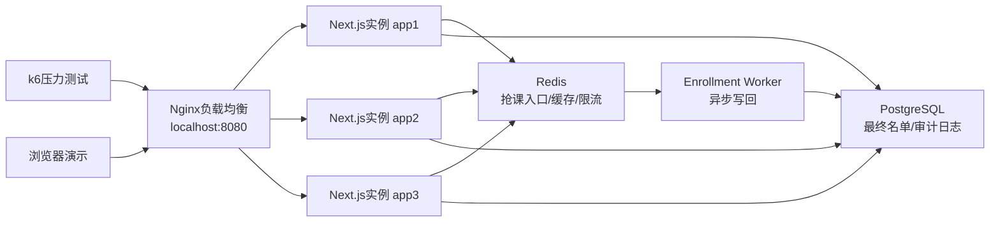

# 水平扩展部署设计

本文档为课程设计报告的结构设计和测试章节准备部署说明。系统采用本地可演示的多实例部署：Nginx作为统一入口，后端运行三个Next.js实例，写回Worker独立运行，所有实例共享PostgreSQL和Redis。

## 部署拓扑



## 关键设计

Nginx负责把学生请求分发到多个Next.js实例。应用实例不保存本地会话状态，登录会话、选课状态和限流状态分别由数据库和Redis承载，因此可以水平扩展。抢课入口使用Redis原子预占，避免多个实例同时写数据库造成容量竞争；Worker独立消费写回任务，把预占结果最终写入PostgreSQL。

## 本地演示命令

```powershell
docker compose -f docker-compose.lb.yml build
docker compose -f docker-compose.lb.yml up
```

若修改过`Dockerfile`或应用代码，需要重新执行`build`后再`up`，否则Nginx可能仍然连接到旧镜像启动失败的应用容器。

健康检查：

```powershell
curl http://localhost:8080/api/health
```

1000名学生抢100个名额：

```powershell
$env:LOAD_STUDENT_COUNT="1000"
$env:LOAD_COURSE_CAPACITY="100"
pnpm exec tsx scripts/seed-load-test.ts
k6 run --env MODE=flash --env BASE_URL=http://localhost:8080 --env VUS=1000 --env P95_THRESHOLD_MS=2000 tests/load/enrollment.js
```

压测后执行写回和校验：

```powershell
$env:ENROLLMENT_WORKER_BATCH="1200"
$env:ENROLLMENT_WORKER_ONCE="1"
pnpm exec tsx scripts/enrollment-worker.ts
pnpm exec tsx scripts/summarize-load-result.ts
```

## 答辩表达

该部署设计用于说明系统具备水平扩展基础。Web实例可以横向增加，Redis承担高并发入口削峰，PostgreSQL保存最终业务事实，Worker负责异步一致性。压测结果应重点展示：Nginx入口、并发学生数、正式入选数、容量满响应、服务错误数和压测后数据库一致性。
