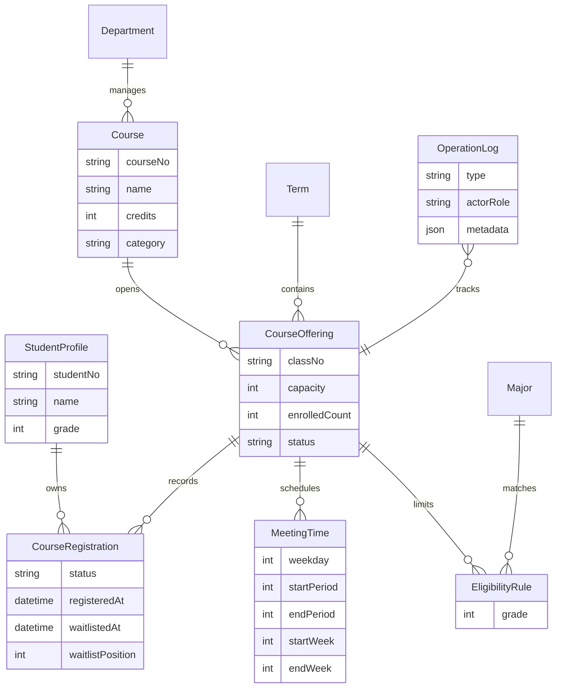
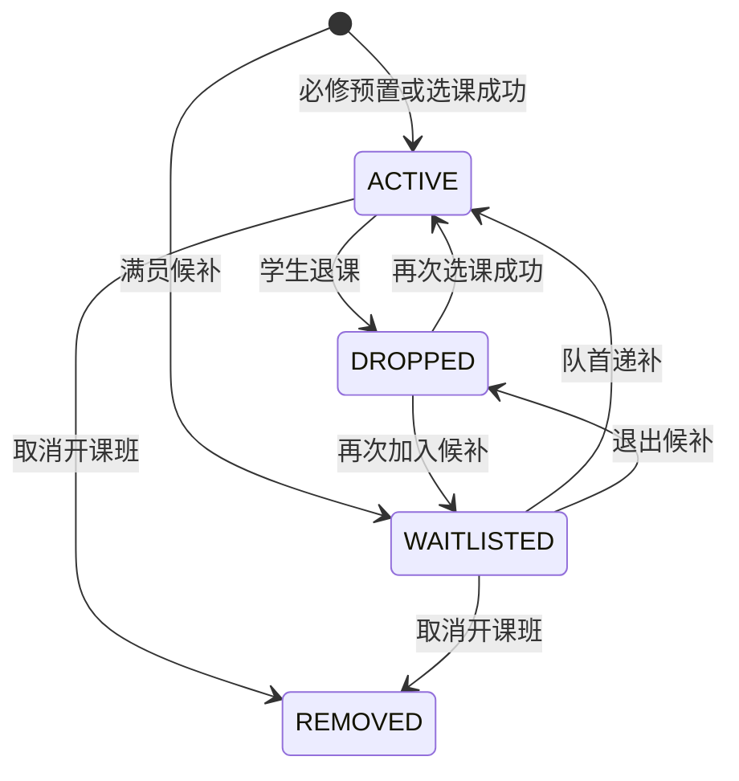

# ICONIX建模证据

本系统围绕校园选课这一核心业务展开。学生在开放期内查看课程、提交选课、加入候补、退出候补和退课，管理员维护开放期、关闭名单、取消开课班和查看结果。分析阶段将选课登记作为核心领域对象，课程容量、资格规则、时间冲突和候补顺位都围绕该对象变化。

## 2.1 用例模型

表2.1列出系统答辩时建议重点展示的核心用例。每个用例均能从页面操作追踪到服务层事务和数据库状态变化。

表2.1 核心用例清单

| 用例 | 参与者 | 主要目标 | 关键规则 |
| --- | --- | --- | --- |
| 学生选课 | 学生 | 将可选课程登记为有效选课 | 开放期、课程状态、类别、资格、容量、时间冲突 |
| 学生加入候补 | 学生 | 满员课程进入候补队列 | 其他规则通过、容量已满、按顺位排队 |
| 学生退出候补 | 学生 | 放弃候补登记 | 候补记录存在、开课班仍开放 |
| 学生退课并触发递补 | 学生 | 退出现有选课并释放容量 | 必修课不可退、队首候补自动转正 |
| 管理员关闭名单 | 管理员 | 冻结开课班名单 | 关闭后不可选、不可退、保留名单 |
| 管理员取消开课班 | 管理员 | 取消课程并移除名单 | 有效登记和候补登记统一移除 |
| 管理员查看名单 | 管理员 | 追踪有效、候补、退课、移除记录 | 名单、容量、日志保持一致 |

表2.2展示学生选课用例文本。该用例是后续候补、退课和递补的主干。

表2.2 学生选课用例说明

| 项目 | 内容 |
| --- | --- |
| 前置条件 | 学生已登录；学生档案存在；当前学期存在；选课开放期未结束 |
| 基本事件流 | 学生打开选课页；系统加载学生档案、当前学期课程和已有登记；学生查看课程详情；系统展示规则诊断；学生点击选课；系统校验开放期、课程状态、课程类别、专业年级、容量和时间冲突；系统写入有效登记；系统增加已选人数；系统写入操作日志；页面刷新课表 |
| 扩展事件流 | 若课程满员且其他规则通过，系统写入候补登记并分配顺位；若课程时间冲突，系统拒绝提交并在规则区标记冲突课程；若课程已关闭或取消，系统拒绝提交；若重复提交，系统保持容量不重复增加 |
| 后置条件 | 成功时产生`ACTIVE`或`WAITLISTED`登记；失败时登记和容量不变化；操作日志记录业务动作 |

表2.3展示退课递补用例。该用例体现候补队列的业务闭环。

表2.3 退课递补用例说明

| 项目 | 内容 |
| --- | --- |
| 前置条件 | 学生已登录；存在本人有效登记；课程类别为专业选修或公选课；开课班状态为开放 |
| 基本事件流 | 学生在课表中点击退课；系统读取登记、课程和学生信息；系统校验必修课和开放期规则；系统将原登记改为退课；系统减少已选人数；系统查找同一开课班候补队首；系统将队首候补改为有效登记；系统恢复已选人数；系统写入退课日志和递补日志 |
| 扩展事件流 | 若无候补记录，系统只完成退课；若登记为候补，系统执行退出候补，容量不变化；若课程已关闭，系统拒绝退课 |
| 后置条件 | 原学生登记转为`DROPPED`；若存在候补队首，该登记转为`ACTIVE`；容量计数仍与有效登记数量一致 |

## 2.2 领域模型

如图2.1所示，系统领域对象以学生、学期、课程、开课班、上课时间、资格规则、选课登记和操作日志为主。候补队列没有单独建表，同一开课班下`WAITLISTED`登记按`waitlistPosition`排列即可形成队列关系。

图2.1 选课系统领域模型

选课登记的状态迁移如图2.2所示。必修课由种子数据直接形成有效登记，学生自主选课可形成有效登记或候补登记。退课、退出候补和取消开课班都会改变登记状态，操作日志记录迁移原因。

图2.2 选课登记状态机

## 2.3 鲁棒分析

鲁棒分析将页面、服务和实体对象串联起来。表2.4列出核心用例中的边界对象、控制对象和实体对象。

表2.4 鲁棒分析对象清单

| 用例 | 边界对象 | 控制对象 | 实体对象 |
| --- | --- | --- | --- |
| 学生选课 | 学生选课页、课程详情抽屉 | 规则诊断构造器、选课事务服务 | 学生档案、学期、开课班、资格规则、上课时间、选课登记、操作日志 |
| 学生加入候补 | 学生选课页、课程详情抽屉 | 选课事务服务、候补顺位分配 | 开课班、选课登记、操作日志 |
| 学生退课并触发递补 | 课表页、节次矩阵 | 退课递补服务、候补队列查询 | 开课班、选课登记、操作日志 |
| 管理员取消开课班 | 管理控制台、课程详情抽屉 | 管理员课程服务 | 开课班、选课登记、操作日志 |
| 管理员查看名单 | 管理控制台、课程详情抽屉 | 管理统计查询服务 | 开课班、选课登记、学生档案、操作日志 |

鲁棒分析的关键结论是职责分界清晰。边界对象只负责收集操作和展示规则结果；控制对象集中处理规则判断、事务一致性和状态迁移；实体对象保存业务事实。这样的划分可以从用例文本自然过渡到服务层函数和Prisma模型。

## 2.4 可追溯矩阵

表2.5展示从需求到实现和测试的追踪关系。该矩阵可放入报告分析结论或测试章节，用来说明设计成果支撑后续实现。

表2.5 需求追踪矩阵

| 需求或规则 | 领域对象 | 控制对象 | 主要实现 | 测试证据 |
| --- | --- | --- | --- | --- |
| 专业选修资格校验 | 学生档案、资格规则、开课班 | 规则诊断构造器 | `buildCourseRuleChecks` | 规则诊断集成测试 |
| 时间冲突拒绝 | 上课时间、选课登记 | 规则诊断构造器 | `hasMeetingConflict` | 课表单元测试、冲突集成测试 |
| 容量不超卖 | 开课班、选课登记 | 选课事务服务 | Serializable事务、开课班锁 | 并发抢课集成测试 |
| 满员候补 | 开课班、选课登记 | 候补顺位分配 | `WAITLISTED`状态、`waitlistPosition` | 候补入队测试 |
| 退课自动递补 | 选课登记、操作日志 | 退课递补服务 | 队首候补转为`ACTIVE` | 自动递补测试 |
| 取消开课班 | 开课班、选课登记 | 管理员课程服务 | 有效和候补统一转为`REMOVED` | 管理端取消测试 |
| 结果追踪 | 操作日志、选课登记 | 管理统计查询服务 | 管理详情、CSV导出、结果API | 管理详情测试 |
