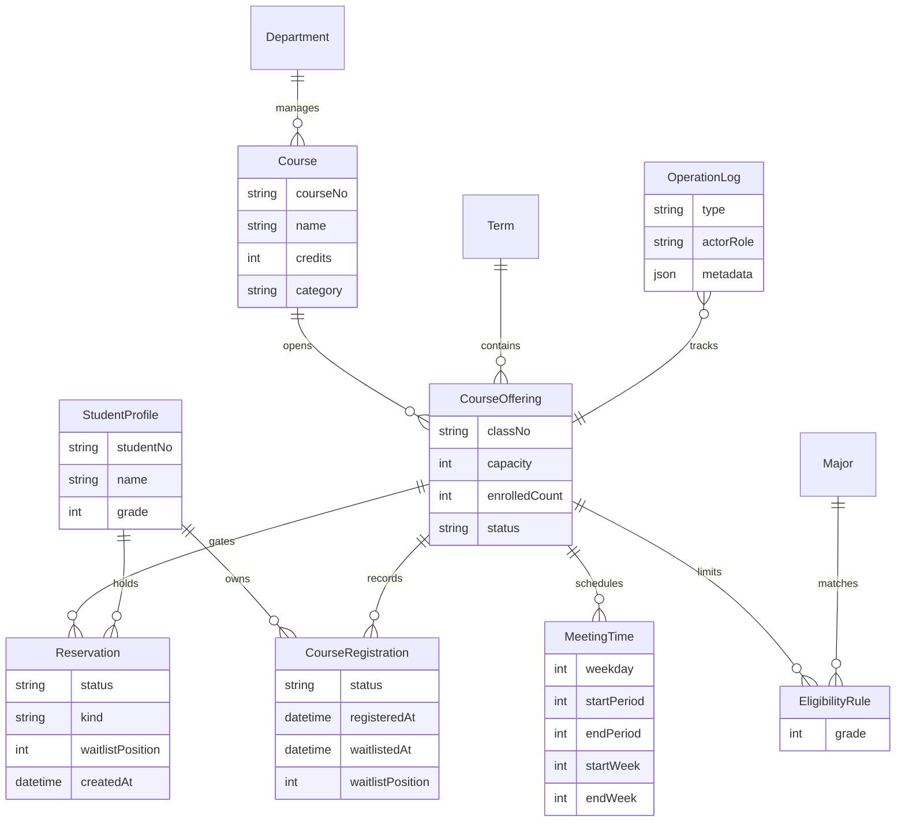
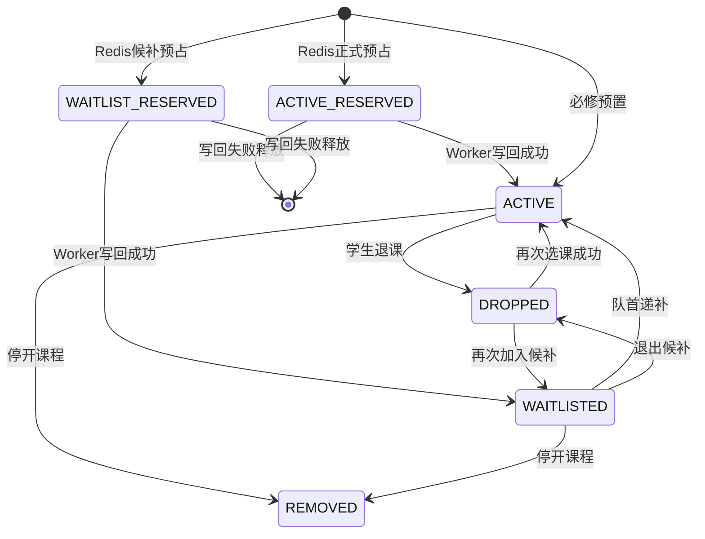

# ICONIX建模证据

本系统围绕校园选课这一核心业务展开。学生在开放期内查看课程、提交选课、加入候补、退出候补和退课，管理员维护开放期、冻结名单、停开课程和查看结果。分析阶段将选课登记作为核心领域对象，课程容量、资格规则、时间冲突和候补顺位都围绕该对象变化。为支撑高并发开选场景，系统额外引入Redis中的临时预占状态`Reservation`，用于表达“已抢到入口名额但尚未写回最终登记”的短生命周期业务事实。

## 2.1 用例模型

表2.1列出系统答辩时建议重点展示的核心用例。每个用例均能从页面操作追踪到服务层事务和数据库状态变化。

表2.1 核心用例清单

| 用例 | 参与者 | 主要目标 | 关键规则 |
| --- | --- | --- | --- |
| 学生选课 | 学生 | 将可选课程登记为有效选课 | 开放期、课程状态、类别、资格、容量、时间冲突 |
| 学生加入候补 | 学生 | 满员课程进入候补队列 | 其他规则通过、容量已满、按顺位排队 |
| 异步确认登记 | 系统Worker | 将Redis预占写回最终登记 | 幂等写入、失败释放、日志审计 |
| 学生退出候补 | 学生 | 放弃候补登记 | 候补记录存在、开课班仍开放 |
| 学生退课并触发递补 | 学生 | 退出现有选课并释放容量 | 必修课不可退、队首候补自动转正 |
| 管理员冻结名单 | 管理员 | 冻结开课班名单 | 冻结后不可选、不可退、保留名单 |
| 管理员停开课程 | 管理员 | 停开课程并移除名单 | 有效登记和候补登记统一移除 |
| 管理员查看名单 | 管理员 | 追踪有效、候补、退课、移除记录 | 名单、容量、日志保持一致 |
| 管理员处理写回积压 | 管理员 | 观察并处理异步写回中间状态 | Redis预占、Worker任务、DB登记最终一致 |

表2.2展示学生选课用例文本。该用例是后续候补、退课和递补的主干。

表2.2 学生选课用例说明

| 项目 | 内容 |
| --- | --- |
| 前置条件 | 学生已登录；学生档案存在；当前学期存在；选课开放期未结束 |
| 基本事件流 | 学生打开选课页；系统加载学生档案、当前学期课程、已有登记和Redis预占；学生查看课程详情；系统展示规则诊断；学生点击选课；系统校验开放期、课程状态、课程类别、专业年级和时间冲突；Redis容量闸门原子预占正式名额；系统立即返回`ACTIVE`预占并刷新课表；Worker异步写入`ACTIVE`登记、增加已选人数并写入操作日志 |
| 扩展事件流 | 若课程满员，系统返回`COURSE_FULL`，页面刷新后显示候补入口；若课程时间冲突，系统拒绝提交并在规则区标记冲突课程；若课程名单已冻结或课程已停开，系统拒绝提交；若重复提交，Redis预占记录阻止重复占位 |
| 后置条件 | 成功时先产生Redis `ACTIVE_RESERVED`，随后由Worker确认为`ACTIVE`登记；失败时登记和容量不变化；操作日志由异步写回阶段记录 |

表2.3展示学生加入候补用例。候补不再由选课动作自动产生，而是学生在满员后明确提交的第二个业务动作。

表2.3 学生加入候补用例说明

| 项目 | 内容 |
| --- | --- |
| 前置条件 | 学生已登录；课程处于开放状态；除容量外的规则通过；Redis容量闸门显示正式名额已满 |
| 基本事件流 | 学生点击候补；系统校验开放期、课程状态、课程类别、专业年级和时间冲突；Redis生成候补预占并递增候补序号；页面立即显示候补中；Worker异步写入`WAITLISTED`登记、保存候补顺位并记录日志 |
| 扩展事件流 | 若正式名额在提交候补前已经释放，系统返回`SEAT_AVAILABLE`，学生可重新选课；若重复候补，系统保持原有预占和顺位；若写回失败，Worker释放预占，页面刷新后回到最新状态 |
| 后置条件 | 成功时产生`WAITLIST_RESERVED`并最终写回`WAITLISTED`登记；候补不增加`enrolledCount`，不计入已选学分，但占用意向课表 |

表2.4展示退课递补用例。该用例体现候补队列的业务闭环。

表2.4 退课递补用例说明

| 项目 | 内容 |
| --- | --- |
| 前置条件 | 学生已登录；存在本人有效登记；课程类别为专业选修或公选课；开课班状态为开放 |
| 基本事件流 | 学生在课表中点击退课；系统读取登记、课程和学生信息；系统校验必修课和开放期规则；系统将原登记改为退课；系统减少已选人数；系统查找同一开课班候补队首；系统将队首候补改为有效登记；系统恢复已选人数；系统写入退课日志和递补日志 |
| 扩展事件流 | 若无候补记录，系统只完成退课；若登记为候补，系统执行退出候补，容量不变化；若课程名单已冻结，系统拒绝退课 |
| 后置条件 | 原学生登记转为`DROPPED`；若存在候补队首，该登记转为`ACTIVE`；容量计数仍与有效登记数量一致 |

## 2.2 领域模型

如图2.1所示，系统领域对象以学生、学期、课程、开课班、上课时间、资格规则、选课登记和操作日志为主。候补队列没有单独建表，同一开课班下`WAITLISTED`登记按`waitlistPosition`排列即可形成队列关系。Redis中的`Reservation`不作为数据库实体建表，但在高并发用例中作为临时领域状态连接用户意图和最终登记。

图2.1 选课系统领域模型

选课登记的状态迁移如图2.2所示。必修课由种子数据直接形成有效登记，学生自主选课先产生Redis预占，再由Worker确认成有效登记或候补登记。退课、退出候补和停开课程都会改变登记状态，操作日志记录迁移原因。

图2.2 选课登记状态机

## 2.3 鲁棒分析

鲁棒分析将页面、服务和实体对象串联起来。表2.5列出核心用例中的边界对象、控制对象和实体对象。

表2.5 鲁棒分析对象清单

| 用例 | 边界对象 | 控制对象 | 实体对象 |
| --- | --- | --- | --- |
| 学生选课 | 学生选课页、课程详情抽屉 | 规则诊断构造器、RedisSeatGate、选课意图服务 | 学生档案、学期、开课班、资格规则、上课时间、Reservation、选课登记 |
| 学生加入候补 | 学生选课页、课程详情抽屉 | RedisSeatGate、候补预占服务、EnrollmentWritebackWorker | 开课班、Reservation、选课登记、操作日志 |
| 异步确认登记 | Redis Stream任务 | EnrollmentWritebackWorker、开课班锁 | 开课班、选课登记、操作日志 |
| 学生退课并触发递补 | 课表页、节次矩阵 | 退课递补服务、候补队列查询 | 开课班、选课登记、操作日志 |
| 管理员停开课程 | 管理控制台、课程详情抽屉 | 管理员课程服务 | 开课班、选课登记、操作日志 |
| 管理员查看名单 | 管理控制台、课程详情抽屉 | 管理统计查询服务 | 开课班、选课登记、学生档案、操作日志 |
| 管理员处理写回积压 | 一致性运维工作区 | EnrollmentOpsService、EnrollmentWritebackWorker | Reservation、开课班、选课登记、操作日志 |

鲁棒分析的关键结论是职责分界清晰。边界对象只负责收集操作和展示规则结果；控制对象集中处理规则判断、事务一致性和状态迁移；实体对象保存业务事实。这样的划分可以从用例文本自然过渡到服务层函数和Prisma模型。

## 2.4 可追溯矩阵

表2.6展示从需求到实现和测试的追踪关系。该矩阵可放入报告分析结论或测试章节，用来说明设计成果支撑后续实现。

表2.6 需求追踪矩阵

| 需求或规则 | 领域对象 | 控制对象 | 主要实现 | 测试证据 |
| --- | --- | --- | --- | --- |
| 专业选修资格校验 | 学生档案、资格规则、开课班 | 规则诊断构造器 | `buildCourseRuleChecks` | 规则诊断集成测试 |
| 时间冲突拒绝 | 上课时间、选课登记 | 规则诊断构造器 | `hasMeetingConflict` | 课表单元测试、冲突集成测试 |
| 容量不超卖 | 开课班、Reservation、选课登记 | RedisSeatGate、EnrollmentWritebackWorker | Redis Lua原子预占、写回阶段开课班锁 | 并发抢课集成测试、k6抢课压测 |
| 满员候补 | 开课班、Reservation、选课登记 | 候补预占服务、EnrollmentWritebackWorker | 显式候补接口、`WAITLISTED`状态、`waitlistPosition` | 候补入队测试、k6候补压测 |
| 退课自动递补 | 选课登记、操作日志 | 退课递补服务 | 队首候补转为`ACTIVE` | 自动递补测试 |
| 停开课程 | 开课班、选课登记 | 管理员课程服务 | 有效和候补统一转为`REMOVED` | 管理端停开测试 |
| 高并发入口削峰 | Reservation、开课班 | RedisSeatGate | Redis Hash、Lua脚本、Stream写回任务 | k6抢课压测、Redis/DB一致性摘要 |
| 异步状态可恢复 | Reservation、选课登记 | EnrollmentOpsService、EnrollmentWritebackWorker | 运维工作区、重投写回、失败预占清理 | 运维服务集成测试 |
| 结果追踪 | 操作日志、选课登记 | 管理统计查询服务 | 管理详情、CSV导出、结果API | 管理详情测试 |
