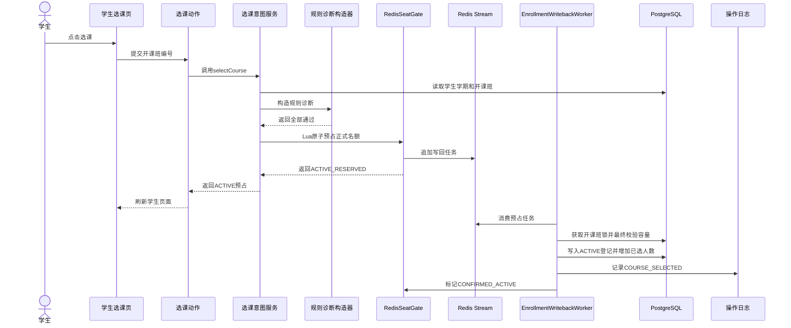
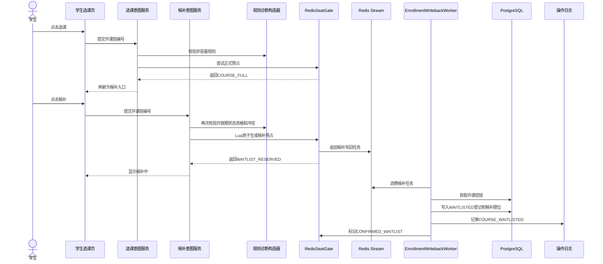
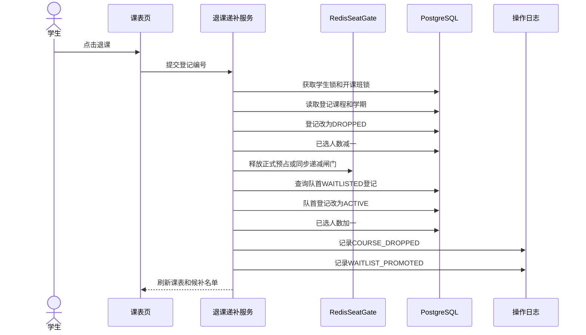
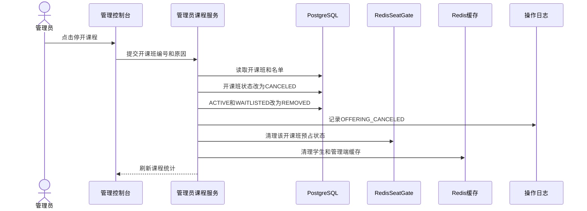

# 关键时序图

本文件整理答辩时可展示的关键时序。每个场景都从用户操作出发，经过边界对象、控制对象和实体对象，最终落到登记状态、容量计数和操作日志。

## 3.4.1 正常选课预占与写回时序

正常选课场景展示系统如何从学生点击按钮推进到有效登记。该场景分为两个阶段：请求线程完成规则校验和Redis正式名额预占，Worker线程再异步写回PostgreSQL登记和操作日志。

图3.1 正常选课时序图

## 3.4.2 满员后显式候补时序

满员候补场景展示系统如何把容量不足转化为候补登记。选课动作本身不自动候补，而是在收到`COURSE_FULL`后由学生明确点击候补。

图3.2 满员候补时序图

## 3.4.3 退课自动递补时序

退课递补场景展示系统如何在一个事务中完成退课、释放容量、队首递补和日志记录。该场景是答辩时说明一致性控制的重点。

图3.3 退课自动递补时序图

## 3.4.4 管理员停开课程时序

管理员停开课程场景展示后台如何批量处理名单。停开操作会移除有效登记和候补登记，日志保存停开原因和影响人数。

图3.4 管理员停开课程时序图

## 3.4.5 时序分析结论

四个时序图共同说明系统的职责分配。页面只提交用户意图，服务层集中处理规则和入口预占，RedisSeatGate负责高并发容量闸门，Worker负责把临时预占确认成PostgreSQL最终登记。数据库保存最终领域状态，日志保存审计事实。学生锁处理退课等同步动作，开课班锁保护写回、候补顺位和递补顺序，Redis Lua脚本保证入口阶段原子预占，二者共同支撑高并发下的容量一致性。
